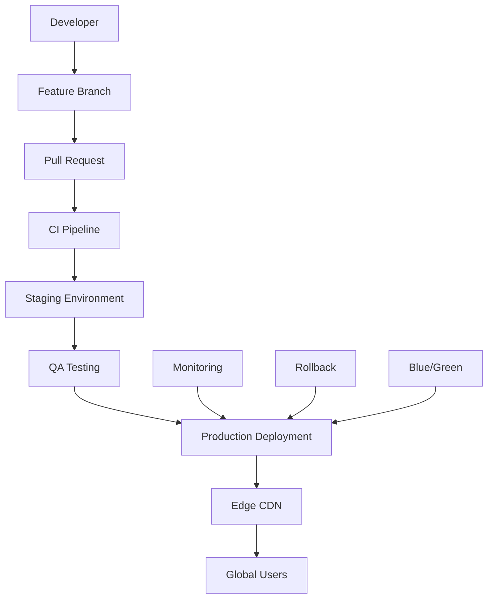

# DevOps & Deployment Guide

> **Cloud-Native CI/CD Pipeline with Zero-Downtime Deployments**  
> Kubernetes, Edge Computing, and Infrastructure as Code best practices

---

## 🎯 **Deployment Architecture**

### Multi-Environment Strategy



### Infrastructure Stack

| Component              | Technology             | Purpose                       |
| ---------------------- | ---------------------- | ----------------------------- |
| **Container Platform** | Kubernetes 1.30+       | Orchestration & scaling       |
| **Service Mesh**       | Istio 1.24+            | Traffic management & security |
| **CDN**                | Cloudflare Enterprise  | Global edge distribution      |
| **Monitoring**         | Grafana + Prometheus   | Observability & alerting      |
| **Security**           | Falco + OPA Gatekeeper | Runtime security & policy     |
| **GitOps**             | ArgoCD + Flux          | Declarative deployments       |

---

## 🚀 **CI/CD Pipeline**

### GitHub Actions Workflow

```yaml
name: Production Deployment Pipeline

on:
  push:
    branches: [main]
  pull_request:
    branches: [main]

env:
  REGISTRY: ghcr.io
  IMAGE_NAME: omnitide/control-panel

jobs:
  security-scan:
    runs-on: ubuntu-latest
    steps:
      - uses: actions/checkout@v4

      - name: Run Trivy vulnerability scanner
        uses: aquasecurity/trivy-action@master
        with:
          scan-type: 'fs'
          scan-ref: '.'
          format: 'sarif'
          output: 'trivy-results.sarif'

      - name: Upload Trivy scan results
        uses: github/codeql-action/upload-sarif@v3
        with:
          sarif_file: 'trivy-results.sarif'

  quality-gates:
    runs-on: ubuntu-latest
    steps:
      - uses: actions/checkout@v4
        with:
          fetch-depth: 0

      - name: Setup Node.js
        uses: actions/setup-node@v4
        with:
          node-version: '20'
          cache: 'npm'

      - name: Install dependencies
        run: npm ci

      - name: Type checking
        run: npm run type-check

      - name: ESLint
        run: npm run lint:check

      - name: Prettier
        run: npm run format:check

      - name: Unit tests
        run: npm run test:coverage

      - name: SonarCloud Scan
        uses: SonarSource/sonarcloud-github-action@master
        env:
          GITHUB_TOKEN: ${{ secrets.GITHUB_TOKEN }}
          SONAR_TOKEN: ${{ secrets.SONAR_TOKEN }}

  e2e-testing:
    runs-on: ubuntu-latest
    needs: [quality-gates]
    steps:
      - uses: actions/checkout@v4

      - name: Setup Node.js
        uses: actions/setup-node@v4
        with:
          node-version: '20'
          cache: 'npm'

      - name: Install dependencies
        run: npm ci

      - name: Install Playwright Browsers
        run: npx playwright install --with-deps

      - name: Build application
        run: npm run build

      - name: Run Playwright tests
        run: npm run e2e

      - name: Upload test results
        uses: actions/upload-artifact@v4
        if: always()
        with:
          name: playwright-report
          path: playwright-report/

  performance-testing:
    runs-on: ubuntu-latest
    needs: [quality-gates]
    steps:
      - uses: actions/checkout@v4

      - name: Setup Node.js
        uses: actions/setup-node@v4
        with:
          node-version: '20'
          cache: 'npm'

      - name: Install dependencies
        run: npm ci

      - name: Build application
        run: npm run build

      - name: Start preview server
        run: npm run preview &

      - name: Wait for server
        run: npx wait-on http://localhost:4173

      - name: Lighthouse CI
        run: |
          npm install -g @lhci/cli
          lhci autorun
        env:
          LHCI_GITHUB_APP_TOKEN: ${{ secrets.LHCI_GITHUB_APP_TOKEN }}

  build-and-push:
    runs-on: ubuntu-latest
    needs: [security-scan, e2e-testing, performance-testing]
    if: github.ref == 'refs/heads/main'
    steps:
      - uses: actions/checkout@v4

      - name: Setup Docker Buildx
        uses: docker/setup-buildx-action@v3

      - name: Login to Container Registry
        uses: docker/login-action@v3
        with:
          registry: ${{ env.REGISTRY }}
          username: ${{ github.actor }}
          password: ${{ secrets.GITHUB_TOKEN }}

      - name: Extract metadata
        id: meta
        uses: docker/metadata-action@v5
        with:
          images: ${{ env.REGISTRY }}/${{ env.IMAGE_NAME }}
          tags: |
            type=ref,event=branch
            type=ref,event=pr
            type=sha,prefix={{branch}}-
            type=raw,value=latest,enable={{is_default_branch}}

      - name: Build and push Docker image
        uses: docker/build-push-action@v5
        with:
          context: .
          platforms: linux/amd64,linux/arm64
          push: true
          tags: ${{ steps.meta.outputs.tags }}
          labels: ${{ steps.meta.outputs.labels }}
          cache-from: type=gha
          cache-to: type=gha,mode=max

  deploy-staging:
    runs-on: ubuntu-latest
    needs: [build-and-push]
    environment: staging
    steps:
      - uses: actions/checkout@v4

      - name: Setup Kubectl
        uses: azure/setup-kubectl@v3
        with:
          version: 'v1.30.0'

      - name: Configure AWS credentials
        uses: aws-actions/configure-aws-credentials@v4
        with:
          aws-access-key-id: ${{ secrets.AWS_ACCESS_KEY_ID }}
          aws-secret-access-key: ${{ secrets.AWS_SECRET_ACCESS_KEY }}
          aws-region: us-west-2

      - name: Update kube config
        run: aws eks update-kubeconfig --name omnitide-staging

      - name: Deploy to staging
        run: |
          kubectl set image deployment/control-panel \
            control-panel=${{ env.REGISTRY }}/${{ env.IMAGE_NAME }}:${{ github.sha }} \
            -n staging
          kubectl rollout status deployment/control-panel -n staging

  deploy-production:
    runs-on: ubuntu-latest
    needs: [deploy-staging]
    environment: production
    if: github.ref == 'refs/heads/main'
    steps:
      - uses: actions/checkout@v4

      - name: Setup Kubectl
        uses: azure/setup-kubectl@v3
        with:
          version: 'v1.30.0'

      - name: Configure AWS credentials
        uses: aws-actions/configure-aws-credentials@v4
        with:
          aws-access-key-id: ${{ secrets.AWS_ACCESS_KEY_ID }}
          aws-secret-access-key: ${{ secrets.AWS_SECRET_ACCESS_KEY }}
          aws-region: us-west-2

      - name: Update kube config
        run: aws eks update-kubeconfig --name omnitide-production

      - name: Blue/Green deployment
        run: |
          # Create new deployment
          kubectl apply -f k8s/production/

          # Wait for rollout
          kubectl rollout status deployment/control-panel-green -n production

          # Switch traffic
          kubectl patch service control-panel -p '{"spec":{"selector":{"app":"control-panel-green"}}}' -n production

          # Clean up old deployment
          kubectl delete deployment control-panel-blue -n production --ignore-not-found

          # Rename deployments
          kubectl patch deployment control-panel-green -p '{"metadata":{"name":"control-panel-blue"}}' -n production
```

---

## 🐳 **Container Strategy**

### Multi-Stage Dockerfile

```dockerfile
# Build stage
FROM node:20-alpine AS builder

WORKDIR /app

# Copy package files
COPY package*.json ./
COPY tsconfig*.json ./
COPY vite.config.ts ./
COPY tailwind.config.js ./
COPY postcss.config.cjs ./

# Install dependencies
RUN npm ci --only=production --ignore-scripts

# Copy source code
COPY src/ ./src/
COPY public/ ./public/
COPY index.html ./

# Build application
RUN npm run build

# Production stage
FROM nginx:1.25-alpine AS production

# Install security updates
RUN apk update && apk upgrade && \
    apk add --no-cache ca-certificates && \
    rm -rf /var/cache/apk/*

# Copy nginx configuration
COPY nginx.conf /etc/nginx/nginx.conf
COPY mime.types /etc/nginx/mime.types

# Copy built application
COPY --from=builder /app/dist /usr/share/nginx/html

# Add health check
HEALTHCHECK --interval=30s --timeout=3s --start-period=5s --retries=3 \
  CMD wget --no-verbose --tries=1 --spider http://localhost:80/health || exit 1

# Create non-root user
RUN addgroup -g 1001 -S nginx && \
    adduser -S -D -H -u 1001 -h /var/cache/nginx -s /sbin/nologin -G nginx -g nginx nginx

# Change ownership and switch to non-root user
RUN chown -R nginx:nginx /var/cache/nginx && \
    chown -R nginx:nginx /var/log/nginx && \
    chown -R nginx:nginx /etc/nginx/conf.d
RUN touch /var/run/nginx.pid && \
    chown -R nginx:nginx /var/run/nginx.pid

USER nginx

EXPOSE 80

CMD ["nginx", "-g", "daemon off;"]
```

### Nginx Configuration

```nginx
user nginx;
worker_processes auto;
error_log /var/log/nginx/error.log notice;
pid /var/run/nginx.pid;

events {
    worker_connections 1024;
    use epoll;
    multi_accept on;
}

http {
    include /etc/nginx/mime.types;
    default_type application/octet-stream;

    # Logging
    log_format main '$remote_addr - $remote_user [$time_local] "$request" '
                    '$status $body_bytes_sent "$http_referer" '
                    '"$http_user_agent" "$http_x_forwarded_for"';
    access_log /var/log/nginx/access.log main;

    # Performance
    sendfile on;
    tcp_nopush on;
    tcp_nodelay on;
    keepalive_timeout 65;
    types_hash_max_size 2048;
    client_max_body_size 16M;

    # Gzip compression
    gzip on;
    gzip_vary on;
    gzip_min_length 1024;
    gzip_proxied any;
    gzip_comp_level 6;
    gzip_types
        text/plain
        text/css
        text/xml
        text/javascript
        application/json
        application/javascript
        application/xml+rss
        application/atom+xml
        image/svg+xml;

    # Security headers
    add_header X-Frame-Options DENY always;
    add_header X-Content-Type-Options nosniff always;
    add_header X-XSS-Protection "1; mode=block" always;
    add_header Referrer-Policy "strict-origin-when-cross-origin" always;
    add_header Content-Security-Policy "default-src 'self'; script-src 'self' 'unsafe-inline' 'unsafe-eval'; style-src 'self' 'unsafe-inline'; img-src 'self' data: https:; font-src 'self' data:; connect-src 'self' https: wss:;" always;

    server {
        listen 80;
        server_name _;
        root /usr/share/nginx/html;
        index index.html;

        # Health check endpoint
        location /health {
            access_log off;
            return 200 "healthy\n";
            add_header Content-Type text/plain;
        }

        # Static assets with long-term caching
        location ~* \.(js|css|png|jpg|jpeg|gif|ico|svg|woff|woff2|ttf|eot)$ {
            expires 1y;
            add_header Cache-Control "public, no-transform, immutable";
            add_header Vary "Accept-Encoding";
        }

        # HTML files with short caching
        location ~* \.html$ {
            expires 1h;
            add_header Cache-Control "public, no-transform";
        }

        # SPA fallback
        location / {
            try_files $uri $uri/ /index.html;
            expires 1h;
            add_header Cache-Control "public, no-transform";
        }

        # Deny access to hidden files
        location ~ /\. {
            deny all;
        }
    }
}
```

---

## ☸️ **Kubernetes Deployment**

### Production Deployment

```yaml
# k8s/production/deployment.yaml
apiVersion: apps/v1
kind: Deployment
metadata:
  name: control-panel
  namespace: production
  labels:
    app: control-panel
    version: v1.0.0
spec:
  replicas: 3
  strategy:
    type: RollingUpdate
    rollingUpdate:
      maxUnavailable: 1
      maxSurge: 1
  selector:
    matchLabels:
      app: control-panel
  template:
    metadata:
      labels:
        app: control-panel
        version: v1.0.0
      annotations:
        prometheus.io/scrape: 'true'
        prometheus.io/port: '9090'
        prometheus.io/path: '/metrics'
    spec:
      serviceAccountName: control-panel
      containers:
        - name: control-panel
          image: ghcr.io/omnitide/control-panel:latest
          ports:
            - containerPort: 80
              name: http
            - containerPort: 9090
              name: metrics
          resources:
            requests:
              memory: '256Mi'
              cpu: '100m'
            limits:
              memory: '512Mi'
              cpu: '500m'
          livenessProbe:
            httpGet:
              path: /health
              port: 80
            initialDelaySeconds: 30
            periodSeconds: 10
            timeoutSeconds: 5
            failureThreshold: 3
          readinessProbe:
            httpGet:
              path: /health
              port: 80
            initialDelaySeconds: 5
            periodSeconds: 5
            timeoutSeconds: 3
            failureThreshold: 3
          securityContext:
            allowPrivilegeEscalation: false
            runAsNonRoot: true
            runAsUser: 1001
            capabilities:
              drop:
                - ALL
            seccompProfile:
              type: RuntimeDefault
          env:
            - name: NODE_ENV
              value: 'production'
            - name: API_BASE_URL
              valueFrom:
                configMapKeyRef:
                  name: control-panel-config
                  key: api-base-url
---
apiVersion: v1
kind: Service
metadata:
  name: control-panel
  namespace: production
  labels:
    app: control-panel
spec:
  selector:
    app: control-panel
  ports:
    - name: http
      port: 80
      targetPort: 80
    - name: metrics
      port: 9090
      targetPort: 9090
  type: ClusterIP
---
apiVersion: networking.k8s.io/v1
kind: Ingress
metadata:
  name: control-panel
  namespace: production
  annotations:
    kubernetes.io/ingress.class: 'nginx'
    cert-manager.io/cluster-issuer: 'letsencrypt-prod'
    nginx.ingress.kubernetes.io/ssl-redirect: 'true'
    nginx.ingress.kubernetes.io/force-ssl-redirect: 'true'
    nginx.ingress.kubernetes.io/hsts: 'true'
    nginx.ingress.kubernetes.io/hsts-max-age: '31536000'
    nginx.ingress.kubernetes.io/rate-limit: '100'
spec:
  tls:
    - hosts:
        - control.omnitide.dev
      secretName: control-panel-tls
  rules:
    - host: control.omnitide.dev
      http:
        paths:
          - path: /
            pathType: Prefix
            backend:
              service:
                name: control-panel
                port:
                  number: 80
---
apiVersion: policy/v1
kind: PodDisruptionBudget
metadata:
  name: control-panel
  namespace: production
spec:
  minAvailable: 2
  selector:
    matchLabels:
      app: control-panel
```

### Horizontal Pod Autoscaler

```yaml
# k8s/production/hpa.yaml
apiVersion: autoscaling/v2
kind: HorizontalPodAutoscaler
metadata:
  name: control-panel
  namespace: production
spec:
  scaleTargetRef:
    apiVersion: apps/v1
    kind: Deployment
    name: control-panel
  minReplicas: 3
  maxReplicas: 10
  metrics:
    - type: Resource
      resource:
        name: cpu
        target:
          type: Utilization
          averageUtilization: 70
    - type: Resource
      resource:
        name: memory
        target:
          type: Utilization
          averageUtilization: 80
  behavior:
    scaleDown:
      stabilizationWindowSeconds: 300
      policies:
        - type: Percent
          value: 10
          periodSeconds: 60
    scaleUp:
      stabilizationWindowSeconds: 0
      policies:
        - type: Percent
          value: 100
          periodSeconds: 15
        - type: Pods
          value: 4
          periodSeconds: 15
      selectPolicy: Max
```

---

## 📊 **Monitoring & Observability**

### Prometheus Metrics

```typescript
// src/services/metrics.ts
import {
  register,
  collectDefaultMetrics,
  Counter,
  Histogram,
  Gauge,
} from 'prom-client';

// Default metrics
collectDefaultMetrics({ register });

// Custom metrics
export const httpRequestDuration = new Histogram({
  name: 'http_request_duration_seconds',
  help: 'Duration of HTTP requests in seconds',
  labelNames: ['method', 'route', 'status_code'],
  buckets: [0.1, 0.3, 0.5, 0.7, 1, 3, 5, 7, 10],
});

export const httpRequestTotal = new Counter({
  name: 'http_requests_total',
  help: 'Total number of HTTP requests',
  labelNames: ['method', 'route', 'status_code'],
});

export const activeConnections = new Gauge({
  name: 'websocket_connections_active',
  help: 'Number of active WebSocket connections',
});

export const webglFrameRate = new Gauge({
  name: 'webgl_frame_rate',
  help: 'WebGL rendering frame rate',
});

// Export metrics endpoint
export const getMetrics = () => register.metrics();
```

### Grafana Dashboard

```json
{
  "dashboard": {
    "title": "Omnitide Control Panel",
    "panels": [
      {
        "title": "Request Rate",
        "type": "graph",
        "targets": [
          {
            "expr": "rate(http_requests_total[5m])",
            "legendFormat": "{{method}} {{route}}"
          }
        ]
      },
      {
        "title": "Response Time",
        "type": "graph",
        "targets": [
          {
            "expr": "histogram_quantile(0.95, rate(http_request_duration_seconds_bucket[5m]))",
            "legendFormat": "95th percentile"
          }
        ]
      },
      {
        "title": "Error Rate",
        "type": "singlestat",
        "targets": [
          {
            "expr": "rate(http_requests_total{status_code!~\"2..\"}[5m]) / rate(http_requests_total[5m])",
            "legendFormat": "Error Rate"
          }
        ]
      }
    ]
  }
}
```

---

## 🔒 **Security & Compliance**

### Network Policies

```yaml
# k8s/production/network-policy.yaml
apiVersion: networking.k8s.io/v1
kind: NetworkPolicy
metadata:
  name: control-panel-netpol
  namespace: production
spec:
  podSelector:
    matchLabels:
      app: control-panel
  policyTypes:
    - Ingress
    - Egress
  ingress:
    - from:
        - namespaceSelector:
            matchLabels:
              name: ingress-nginx
      ports:
        - protocol: TCP
          port: 80
    - from:
        - namespaceSelector:
            matchLabels:
              name: monitoring
      ports:
        - protocol: TCP
          port: 9090
  egress:
    - to:
        - namespaceSelector:
            matchLabels:
              name: backend
      ports:
        - protocol: TCP
          port: 8080
    - to: []
      ports:
        - protocol: TCP
          port: 53
        - protocol: UDP
          port: 53
    - to: []
      ports:
        - protocol: TCP
          port: 443
```

### Pod Security Standards

```yaml
# k8s/production/pod-security-policy.yaml
apiVersion: policy/v1beta1
kind: PodSecurityPolicy
metadata:
  name: control-panel-psp
spec:
  privileged: false
  allowPrivilegeEscalation: false
  requiredDropCapabilities:
    - ALL
  volumes:
    - 'configMap'
    - 'emptyDir'
    - 'projected'
    - 'secret'
    - 'downwardAPI'
    - 'persistentVolumeClaim'
  runAsUser:
    rule: 'MustRunAsNonRoot'
  seLinux:
    rule: 'RunAsAny'
  fsGroup:
    rule: 'RunAsAny'
```

---

## 🌍 **Edge Computing & CDN**

### Cloudflare Configuration

```javascript
// cloudflare-worker.js
addEventListener('fetch', (event) => {
  event.respondWith(handleRequest(event.request));
});

async function handleRequest(request) {
  const cache = caches.default;
  const cacheKey = new Request(request.url, request);

  // Check cache first
  let response = await cache.match(cacheKey);

  if (!response) {
    // Fetch from origin
    response = await fetch(request);

    // Cache static assets
    if (request.url.includes('/assets/')) {
      const headers = new Headers(response.headers);
      headers.set('Cache-Control', 'max-age=31536000, immutable');
      headers.set('Vary', 'Accept-Encoding');

      response = new Response(response.body, {
        status: response.status,
        statusText: response.statusText,
        headers: headers,
      });

      event.waitUntil(cache.put(cacheKey, response.clone()));
    }
  }

  return response;
}
```

### CDN Edge Rules

```yaml
# cloudflare-rules.yaml
rules:
  - description: 'Cache static assets'
    expression: 'http.request.uri.path matches "^/assets/"'
    action: 'cache'
    cache_settings:
      cache_level: 'cache_everything'
      edge_cache_ttl: 31536000
      browser_cache_ttl: 31536000

  - description: 'Security headers'
    expression: 'true'
    action: 'add_headers'
    headers:
      - name: 'X-Frame-Options'
        value: 'DENY'
      - name: 'X-Content-Type-Options'
        value: 'nosniff'
      - name: 'Strict-Transport-Security'
        value: 'max-age=31536000; includeSubDomains'
```

---

## 📈 **Performance Optimization**

### Bundle Analysis

```bash
# Analyze bundle size
npm run build
npm run analyze

# Performance testing
npm run perf

# Load testing
k6 run load-test.js
```

### Load Testing Script

```javascript
// load-test.js
import http from 'k6/http';
import { check, sleep } from 'k6';

export let options = {
  stages: [
    { duration: '2m', target: 100 },
    { duration: '5m', target: 100 },
    { duration: '2m', target: 200 },
    { duration: '5m', target: 200 },
    { duration: '2m', target: 0 },
  ],
  thresholds: {
    http_req_duration: ['p(95)<500'],
    http_req_failed: ['rate<0.1'],
  },
};

export default function () {
  let response = http.get('https://control.omnitide.dev');
  check(response, {
    'status is 200': (r) => r.status === 200,
    'page loads in <500ms': (r) => r.timings.duration < 500,
  });
  sleep(1);
}
```

---

## 🎯 **Deployment Checklist**

### Pre-Deployment

- [ ] All tests passing (unit, integration, e2e)
- [ ] Security scan completed
- [ ] Performance benchmarks met
- [ ] Documentation updated
- [ ] Database migrations ready
- [ ] Rollback plan prepared

### Deployment

- [ ] Blue/green deployment initiated
- [ ] Health checks passing
- [ ] Monitoring alerts configured
- [ ] Traffic gradually shifted
- [ ] Performance metrics validated

### Post-Deployment

- [ ] Application functionality verified
- [ ] Performance monitoring active
- [ ] Error rates within acceptable limits
- [ ] User feedback channels monitored
- [ ] Rollback capability confirmed

---

_Last updated: January 2025_
_Next review: February 2025_
