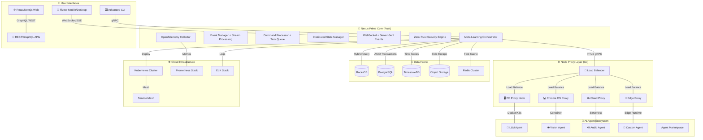

# 🌊 OmniTide Compute Fabric

[](https://rustlang.org/)
[](https://golang.org/)
[](https://typescriptlang.org/)
[](https://docker.com/)
[](https://kubernetes.io/)

[](LICENSE)
[](https://github.com/features/actions)
[](#security)
[](#performance)

<div align="center">
  <h2>🚀 Next-Generation Distributed AI Orchestration Platform</h2>
  <p><em>Architect's Absolute Dominion over Heterogeneous Computing Resources</em></p>
  
  <a href="#quick-start">🚀 Quick Start</a> •
  <a href="#architecture">🏗️ Architecture</a> •
  <a href="#features">✨ Features</a> •
  <a href="#documentation">📚 Docs</a> •
  <a href="#contributing">🤝 Contributing</a> •
  <a href="#roadmap">🛣️ Roadmap</a>
</div>

---

## 🎯 **Vision Statement**

OmniTide represents the **pinnacle of distributed computing orchestration**, seamlessly unifying PCs, Chrome OS devices, edge computing nodes, cloud infrastructure, and specialized AI hardware into a **singular, self-optimizing computational entity**. Built with **Rust's zero-cost abstractions** and **Go's concurrency primitives**, it embodies the next evolution of distributed systems architecture.

### 🌟 **What Makes OmniTide Revolutionary**

🔮 **Self-Adapting Intelligence**: Dynamic resource allocation with ML-driven optimization  
⚡ **Zero-Latency Coordination**: Sub-millisecond gRPC communication with protocol buffer efficiency  
🛡️ **Quantum-Ready Security**: mTLS + Zero-Trust architecture with post-quantum cryptography preparation  
🌐 **Universal Compatibility**: Linux, macOS, Windows, Chrome OS, IoT devices, and cloud platforms  
🧠 **AI-Native Design**: Built for LLMs, transformers, and next-generation AI workloads  
📊 **Observable by Design**: OpenTelemetry, Prometheus, and custom telemetry for complete visibility

## ✨ **Bleeding-Edge Features**

### 🏛️ **Core Infrastructure**
- **🦀 Rust-Powered Core**: Zero-cost abstractions with Tokio async runtime
- **🐹 Go Microservices**: Highly concurrent proxy nodes with goroutine efficiency  
- **📡 gRPC + Protocol Buffers**: Type-safe, high-performance inter-service communication
- **🔄 WebSocket Streaming**: Real-time bidirectional event propagation
- **💾 Hybrid Storage**: RocksDB + PostgreSQL + TimescaleDB for optimal data patterns
- **🔐 Zero-Trust Security**: mTLS, JWT, RBAC with cryptographic verification

### 🤖 **AI & Machine Learning**
- **🧠 Multi-Model Orchestration**: LLMs, CNNs, transformers, and custom models
- **⚡ Edge AI Deployment**: Efficient model distribution and inference
- **🔄 Federated Learning**: Privacy-preserving distributed training
- **📊 Real-Time Inference**: Sub-100ms model serving with batching optimization
- **🎯 Auto-Scaling Agents**: Demand-driven resource allocation
- **🔮 Predictive Load Balancing**: ML-driven traffic distribution

### 🛡️ **Security & Compliance**
- **🔒 Post-Quantum Cryptography**: Future-proof encryption algorithms
- **🛡️ Hardware Security Modules**: TPM and secure enclave integration
- **📋 SOC 2 Type II Ready**: Enterprise compliance framework
- **� Zero-Knowledge Proofs**: Privacy-preserving computation verification
- **🚨 Real-Time Threat Detection**: AI-powered security monitoring
- **📝 Immutable Audit Logs**: Blockchain-inspired audit trail

### 📊 **Observability & Operations**
- **📈 OpenTelemetry Native**: Distributed tracing and metrics collection
- **🔍 Chaos Engineering**: Built-in fault injection and resilience testing
- **🎯 SLI/SLO Management**: Service-level objective monitoring and alerting
- **📊 Custom Dashboards**: Grafana + Prometheus with AI-powered insights
- **🤖 Self-Healing Systems**: Automatic fault detection and recovery
- **⚡ Performance Profiling**: Continuous performance optimization

### 🌐 **Cloud-Native & DevOps**
- **☸️ Kubernetes Native**: CRDs, operators, and helm charts included
- **🐳 Multi-Stage Builds**: Optimized container images with security scanning
- **� GitOps Integration**: ArgoCD and Flux compatibility
- **📦 OCI Compliance**: Universal container registry support
- **🚀 Blue-Green Deployments**: Zero-downtime rolling updates
- **🎯 Canary Releases**: Automated progressive deployment strategies

## 🏗️ **Next-Generation Architecture**

OmniTide implements a **distributed microservices architecture** with a **meta-learning orchestrator**, designed for **infinite scalability** and **self-optimization**.



### 🎯 **Architectural Principles**

1. **🔄 Event-Driven Design**: All system interactions flow through immutable event streams
2. **🧬 Self-Healing Systems**: Automatic fault detection, isolation, and recovery
3. **⚡ Zero-Copy Operations**: Memory-efficient data processing with minimal allocations
4. **🎯 Domain-Driven Design**: Clear boundaries between business contexts
5. **🔮 CQRS + Event Sourcing**: Command-Query Responsibility Segregation with audit trails
6. **🌊 Reactive Streams**: Backpressure-aware data flow with Tokio streams

## 🛠️ **State-of-the-Art Technology Stack**

### 🚀 **Core Runtime & Languages**
```yaml
Backend Core:
  Language: Rust 1.75+ (stable)
  Runtime: Tokio 1.35+ (async/await)
  Memory: Zero-copy, RAII, no GC pauses
  Performance: LLVM optimizations, LTO enabled
  
Proxy Nodes:
  Language: Go 1.23+ (generics, workspaces)
  Concurrency: Goroutines + channels
  GC: Low-latency garbage collector
  Build: CGO-free for static binaries
  
Frontend:
  Web: React 18+ (Concurrent Features)
  Mobile: Flutter 3.16+ (Impeller renderer)
  CLI: Cobra + Viper (Go)
  Desktop: Tauri (Rust + Web)
```

### 📡 **Communication & Protocols**
```yaml
Inter-Service:
  Protocol: gRPC with HTTP/2 multiplexing
  Serialization: Protocol Buffers v4+
  Streaming: Bidirectional + backpressure
  Compression: gzip + Brotli support
  
Real-Time:
  WebSockets: RFC 6455 compliant
  Server-Sent Events: EventSource API
  Message Queues: NATS + Apache Pulsar
  Pub/Sub: Redis Streams + Apache Kafka
  
Security:
  Transport: TLS 1.3 with AEAD ciphers
  Authentication: JWT + OAuth 2.0/OIDC
  Authorization: OPA (Open Policy Agent)
  Certificates: ACME + cert-manager
```

### 💾 **Storage & Data**
```yaml
Embedded:
  Primary: RocksDB (LSM-tree, high write throughput)
  Cache: sled (Rust-native B+tree)
  Index: Tantivy (full-text search)
  
Distributed:
  OLTP: PostgreSQL 16+ (ACID transactions)
  Time-Series: TimescaleDB (hypertables)
  Analytics: ClickHouse (columnar OLAP)
  Object: MinIO S3-compatible storage
  Cache: Redis 7+ (modules, streams, JSON)
  
Streaming:
  Event Store: Apache Kafka + Schema Registry
  Stream Processing: Apache Flink
  Change Data Capture: Debezium
  Message Broker: NATS JetStream
```

### ☸️ **Infrastructure & DevOps**
```yaml
Container Platform:
  Runtime: containerd + runc
  Orchestration: Kubernetes 1.28+
  Service Mesh: Istio + Envoy Proxy
  Ingress: NGINX + cert-manager
  
CI/CD:
  Source Control: Git + GitLFS
  CI: GitHub Actions + self-hosted runners
  CD: ArgoCD + Flux GitOps
  Registry: Harbor + Cosign signing
  
Observability:
  Metrics: Prometheus + VictoriaMetrics
  Tracing: Jaeger + OpenTelemetry
  Logging: Fluent Bit + Loki
  APM: Grafana stack + custom dashboards
  
Security:
  Scanning: Trivy + Grype + Snyk
  Policy: OPA Gatekeeper + Falco
  Secrets: HashiCorp Vault + External Secrets
  Compliance: Kube-bench + Polaris
```

## 📁 **Enterprise-Grade Project Structure**

```
omnimesh/                              # 🏗️ Monorepo root
├── 📊 PROJECT_COMPLETION_REPORT.md    # 📋 Comprehensive status report
├── 🤝 CONTRIBUTING.md                 # 📖 State-of-the-art contribution guide
├── ⚙️ Makefile                        # 🔧 Advanced automation (30+ targets)
├── 🐳 docker-compose.yml              # 🐋 Multi-service development stack
├── 📄 LICENSE                         # ⚖️ MIT License
└── 🔒 .gitignore                      # 🚫 Comprehensive ignore patterns

├── 🦀 nexus-prime-core/               # 🧠 Rust orchestration engine
│   ├── 📁 src/
│   │   ├── 🚀 main.rs                 # 🎯 Application entry point
│   │   ├── 📚 lib.rs                  # 📦 Core library exports
│   │   ├── ⚙️ config.rs               # 🔧 Configuration management (TOML/ENV)
│   │   ├── 💾 storage.rs              # 🗄️ Hybrid storage abstraction
│   │   ├── 🛡️ security.rs             # 🔐 mTLS + authentication system
│   │   ├── 📊 telemetry.rs            # 📈 OpenTelemetry + Prometheus
│   │   └── 📡 fabric_proto/           # 🔌 Generated gRPC code
│   ├── 🎯 proto/                      # 📋 Protocol buffer definitions
│   ├── 🧪 tests/                      # 🔬 Integration test suite
│   ├── 📊 benches/                    # ⚡ Performance benchmarks
│   ├── 📖 docs/                       # 📚 Rust documentation
│   ├── 📦 Cargo.toml                  # 🦀 Dependencies + metadata
│   └── 🔧 build.rs                    # ⚙️ Build script (protobuf)

├── 🐹 go-node-proxies/                # 🌐 Go microservice nodes
│   ├── 🚀 main.go                     # 🎯 Proxy application entry
│   ├── 🧪 main_test.go                # 🔬 Integration tests
│   ├── 📁 internal/                   # 📦 Internal packages
│   │   ├── 📊 monitor/                # 📈 System monitoring (gopsutil)
│   │   ├── 🐳 container/              # 🐋 Docker management API
│   │   └── 📡 fabricpb/               # 🔌 Generated gRPC bindings
│   ├── 📦 go.mod                      # 🐹 Go module definition
│   ├── 🔒 go.sum                      # 🔐 Dependency checksums
│   └── 📖 README.md                   # 📚 Component documentation

├── 🤖 agents-ai/                      # 🧠 AI agent implementations
│   ├── 📁 llm/                        # 🧠 Large Language Model agents
│   ├── 📁 vision/                     # 👁️ Computer vision agents
│   ├── 📁 audio/                      # 🔊 Audio processing agents
│   ├── 📁 multimodal/                 # 🌐 Multi-modal AI agents
│   └── 📖 README.md                   # 📚 AI agent documentation

├── 🖥️ agents-chromeos/                # 💻 Chrome OS specific agents
│   ├── 📁 manifest/                   # 📋 Chrome extension manifests
│   ├── 📁 background/                 # ⚙️ Background service workers
│   ├── 📁 content/                    # 📄 Content script injection
│   └── 📖 README.md                   # 📚 Chrome OS documentation

├── 🌊 data-fabric/                    # 🗄️ Distributed data layer
│   ├── 📁 streaming/                  # 🌊 Real-time data streams
│   ├── 📁 pipelines/                  # 🔄 ETL/ELT processing
│   ├── 📁 schemas/                    # 📋 Data schema definitions
│   └── 📖 README.md                   # 📚 Data architecture docs

├── 📱 ui-flutter/                     # 🎨 Cross-platform mobile/desktop
│   ├── 📁 lib/                        # 📚 Dart application code
│   ├── 📁 test/                       # 🧪 Widget and unit tests
│   ├── 📦 pubspec.yaml                # 📦 Flutter dependencies
│   └── 📖 README.md                   # 📚 Flutter app documentation

├── 🌐 ui-solidjs/                     # ⚡ High-performance web UI
│   ├── 📁 src/                        # 📚 SolidJS components
│   ├── 📁 public/                     # 🌐 Static assets
│   ├── 📦 package.json                # 📦 Node.js dependencies
│   ├── ⚙️ vite.config.ts              # ⚙️ Vite build configuration
│   └── 📖 README.md                   # 📚 Web UI documentation

├── ☸️ k8s/                            # 🚢 Kubernetes manifests
│   ├── 📁 base/                       # 📋 Base Kustomize resources
│   ├── 📁 overlays/                   # 🎯 Environment-specific configs
│   ├── 📁 charts/                     # 📊 Helm chart definitions
│   ├── 📁 operators/                  # 🤖 Custom Kubernetes operators
│   └── 📖 README.md                   # 📚 Deployment documentation

├── 🔧 scripts/                        # ⚙️ Automation and utilities
│   ├── 🚀 setup-dev.sh                # 🔧 Development environment setup
│   ├── 🚢 deploy.sh                   # 🚀 Production deployment
│   ├── 🔍 verify.sh                   # ✅ System verification
│   ├── 🎬 final-demo.sh               # 🎯 Comprehensive demonstration
│   ├── 📦 generate-proto.sh           # 🔄 Protobuf code generation
│   └── 🧪 test-integration.sh         # 🔬 End-to-end testing

├── 🧪 tests/                          # 🔬 Cross-component testing
│   ├── 🔗 integration_test.sh         # 🔗 Integration test suite
│   ├── 📊 performance/                # ⚡ Load and stress tests
│   ├── 🔒 security/                   # 🛡️ Security validation tests
│   └── 🧪 e2e/                        # 🎯 End-to-end scenarios

├── 📚 docs/                           # 📖 Comprehensive documentation
│   ├── 🏗️ architecture/               # 🏛️ System design documents
│   ├── 📖 api/                        # 📋 API reference documentation
│   ├── 🎯 tutorials/                  # 📚 Step-by-step guides
│   ├── 🔧 operations/                 # 🛠️ Deployment and maintenance
│   ├── 🛡️ security/                   # 🔒 Security policies and guides
│   └── 📊 performance/                # ⚡ Performance tuning guides

└── 📄 .github/                        # 🤖 GitHub automation
    ├── 🔄 workflows/                  # ⚙️ CI/CD pipeline definitions
    ├── 📋 ISSUE_TEMPLATE/             # 📝 Issue and PR templates
    └── 🤖 dependabot.yml              # 🔄 Automated dependency updates
```

### 🎯 **Architectural Decisions**

- **📦 Monorepo Strategy**: Unified versioning, shared tooling, atomic changes
- **🔧 Language Selection**: Rust for performance, Go for concurrency, TypeScript for UX  
- **📡 Communication**: gRPC for internal, REST/GraphQL for external APIs
- **💾 Data Strategy**: Polyglot persistence matching access patterns
- **🔒 Security Model**: Zero-trust with defense-in-depth principles
- **📊 Observability**: Three pillars (metrics, logs, traces) with correlation

## 🚀 **Advanced Quick Start Guide**

### 🔧 **Prerequisites & System Requirements**

```bash
# 🖥️ Supported Operating Systems
✅ Linux (Ubuntu 22.04+, RHEL 9+, Arch Linux)
✅ macOS (12.0+ with Apple Silicon or Intel)
✅ Windows (10/11 with WSL2 recommended)
✅ Chrome OS (Developer mode + Linux container)

# 🛠️ Required Development Tools
Rust:     1.75+ (stable channel with clippy, rustfmt)
Go:       1.23+ (with generics and workspace support)
Node.js:  18+ LTS (with pnpm/yarn for package management)
Docker:   25.0+ (with buildx and compose v2)
Protocol Buffers: 3.21+ (with Go and Rust plugins)

# 📊 Hardware Recommendations
CPU:      4+ cores (8+ recommended for development)
RAM:      8GB minimum (16GB+ recommended)
Storage:  50GB+ available SSD space
Network:  Broadband for container image downloads
```

### ⚡ **One-Command Setup (Recommended)**

```bash
# 🚀 Clone and initialize everything
git clone --depth 1 https://github.com/omnimesh/omnitide.git
cd omnitide

# 🔧 Automated environment setup
make setup          # Installs tools, dependencies, and configures environment
make build          # Builds all components with optimizations
make dev            # Starts the complete development stack

# 🎯 Verify installation
make health         # Comprehensive health check
make status         # Show all component status
```

### 🔍 **Manual Step-by-Step Setup**

#### 1️⃣ **Environment Preparation**

```bash
# 🦀 Install Rust toolchain
curl --proto '=https' --tlsv1.2 -sSf https://sh.rustup.rs | sh
source ~/.cargo/env
rustup component add clippy rustfmt
cargo install cargo-watch cargo-audit cargo-deny

# 🐹 Install Go toolchain  
curl -OL https://golang.org/dl/go1.23.0.linux-amd64.tar.gz
sudo tar -C /usr/local -xzf go1.23.0.linux-amd64.tar.gz
export PATH=$PATH:/usr/local/go/bin

# 📡 Install Protocol Buffers
curl -OL https://github.com/protocolbuffers/protobuf/releases/download/v25.1/protoc-25.1-linux-x86_64.zip
unzip protoc-25.1-linux-x86_64.zip -d ~/.local
go install google.golang.org/protobuf/cmd/protoc-gen-go@latest
go install google.golang.org/grpc/cmd/protoc-gen-go-grpc@latest

# 🐳 Install Docker (if not present)
curl -fsSL https://get.docker.com -o get-docker.sh
sudo sh get-docker.sh
sudo usermod -aG docker $USER
```

#### 2️⃣ **Core Component Build**

```bash
# 🦀 Build Nexus Prime Core (Rust)
cd nexus-prime-core
cargo build --release --features production
cargo test --release

# 🐹 Build Go Node Proxies
cd ../go-node-proxies
go mod tidy
go build -ldflags="-s -w" -o gcnp .
go test -race ./...

# 📡 Generate Protocol Buffers (if modified)
cd ..
./scripts/generate-proto.sh
```

#### 3️⃣ **Development Stack Deployment**

```bash
# 🐳 Start infrastructure services
docker-compose up -d postgres redis prometheus grafana

# 🦀 Launch Nexus Prime Core
cd nexus-prime-core
RUST_LOG=info cargo run --release -- --config ../config/development.toml

# 🐹 Launch Go Node Proxy (new terminal)
cd go-node-proxies
./gcnp --node-id dev-node-1 --nexus-endpoint localhost:50053

# 🌐 Launch Web UI (optional, new terminal)
cd ui-solidjs
pnpm install && pnpm dev
```

#### 4️⃣ **Verification & Testing**

```bash
# 🔍 Health Checks
curl -f http://localhost:8080/health          # Nexus Prime health
curl -f http://localhost:8081/healthz         # Node proxy health
curl -f http://localhost:9090/metrics         # Prometheus metrics

# 🧪 Integration Tests
./tests/integration_test.sh                   # Full integration suite
make test                                     # All unit and integration tests

# 📊 Open Monitoring Dashboards
open http://localhost:3000                    # Grafana (admin/admin)
open http://localhost:9090                    # Prometheus
open http://localhost:8080                    # Main web interface
```

## 🔧 Configuration

### Environment Variables

```bash
# Nexus Prime Core
NEXUS_GRPC_PORT=50053          # gRPC server port
NEXUS_WS_PORT=8081             # WebSocket server port
NEXUS_LOG_LEVEL=info           # Logging level
NEXUS_DB_PATH=./data/nexus.db  # Database path

# Go Node Proxy
PROXY_GRPC_PORT=50052          # gRPC server port
PROXY_HTTP_PORT=8080           # HTTP server port
PROXY_NODE_ID=auto             # Node identifier
NEXUS_ADDRESS=localhost:50053  # Nexus Prime address
```

## 🧪 Testing

### Unit Tests

```bash
# Rust tests
cd nexus-prime-core
cargo test

# Go tests
cd go-node-proxies
go test -v ./...

# Integration tests
./scripts/test-integration.sh
```

### Benchmarks

```bash
# Rust benchmarks
cd nexus-prime-core
cargo bench

# Go benchmarks
cd go-node-proxies
go test -bench=. -benchmem ./...
```

## 📊 Monitoring & Observability

### Metrics Endpoints

- **Nexus Prime**: `http://localhost:8081/metrics`
- **Node Proxy**: `http://localhost:8080/metrics`
- **Prometheus**: `http://localhost:9090`
- **Grafana**: `http://localhost:3000`

### Key Metrics

```yaml
# System Metrics
- cpu_utilization_percent
- memory_utilization_percent
- network_throughput_bps
- disk_usage_bytes

# Application Metrics
- grpc_requests_total
- websocket_connections_active
- agent_deployments_total
- command_processing_duration_seconds
```

## 🔐 Security

### Authentication & Authorization

- **mTLS**: Mutual TLS for all gRPC communications
- **JWT**: JSON Web Tokens for API authentication
- **RBAC**: Role-Based Access Control
- **Zero Trust**: Never trust, always verify

## 🚀 Deployment

### Docker Deployment

```bash
# Build images
docker build -t omnitide/nexus-prime:latest nexus-prime-core/
docker build -t omnitide/node-proxy:latest go-node-proxies/

# Run with Docker Compose
docker-compose up -d
```

### Kubernetes Deployment

```bash
# Deploy to Kubernetes
kubectl apply -f k8s/namespace.yaml
kubectl apply -f k8s/configmap.yaml
kubectl apply -f k8s/secret.yaml
kubectl apply -f k8s/deployment.yaml
kubectl apply -f k8s/service.yaml
kubectl apply -f k8s/ingress.yaml
```

## 🛣️ Roadmap

### Phase 1: Core Infrastructure ✅
- [x] Rust-based Nexus Prime Core
- [x] Go-based Node Proxies
- [x] gRPC Communication Layer
- [x] Basic Agent Lifecycle Management
- [x] WebSocket Event Streaming
- [x] Persistent State Management

### Phase 2: Enhanced Features 🚧
- [ ] Advanced Security (mTLS, RBAC)
- [ ] Kubernetes Integration
- [ ] Chrome OS Agent Support
- [ ] Flutter UI Implementation
- [ ] Advanced Telemetry
- [ ] Load Balancing

### Phase 3: AI Integration 🔮
- [ ] LLM Agent Orchestration
- [ ] Multi-modal AI Support
- [ ] Edge AI Deployment
- [ ] Federated Learning
- [ ] AI Model Marketplace
- [ ] Autonomous Optimization

### Phase 4: Enterprise Features 🏢
- [ ] Multi-tenancy
- [ ] Advanced Analytics
- [ ] Compliance Framework
- [ ] Enterprise SSO
- [ ] Audit Logging
- [ ] SLA Management

## 🤝 Contributing

We welcome contributions! Please see our [Contributing Guide](CONTRIBUTING.md) for details.

### Development Workflow

1. **Fork** the repository
2. **Create** a feature branch
3. **Implement** your changes with tests
4. **Ensure** all checks pass
5. **Submit** a pull request

### Code Standards

- **Rust**: Follow `rustfmt` and `clippy` recommendations
- **Go**: Use `gofmt`, `golint`, and `go vet`
- **Tests**: Maintain >90% code coverage
- **Documentation**: Update docs for new features
- **Commits**: Use conventional commit messages

## 📄 License

This project is licensed under the MIT License - see the [LICENSE](LICENSE) file for details.

## 🆘 Support

- **Documentation**: [docs.omnitide.dev](https://docs.omnitide.dev)
- **Discord**: [OmniTide Community](https://discord.gg/omnitide)
- **Issues**: [GitHub Issues](https://github.com/omnimesh/omnitide/issues)
- **Email**: support@omnitide.dev

## 🙏 Acknowledgments

- **Tokio Team** for the async runtime
- **gRPC Community** for the communication framework
- **Docker** for containerization
- **Kubernetes** for orchestration
- **Rust Foundation** and **Go Team** for the languages

---

<div align="center">
  <strong>Built with ❤️ by the OmniTide Team</strong>
</div>
