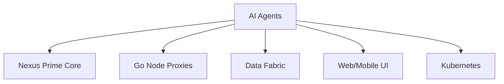

# 🤖 Omnitide AI Agents

[](https://github.com/omnimesh/omnimesh)
[](../LICENSE)
[](../README.md)

> **Next-Generation AI-Powered Autonomous Orchestration and Remediation**

## 🌟 Overview

The **Omnitide AI Agents** subsystem represents the future cognitive layer of the Omnitide Compute Fabric, designed to provide autonomous, intelligent orchestration, monitoring, and remediation capabilities. This module will leverage cutting-edge AI/ML technologies to create self-healing, self-optimizing distributed systems.

## 🎯 Vision & Mission

**Vision**: Create the world's first truly autonomous compute fabric that can reason, learn, and adapt to changing conditions without human intervention.

**Mission**: Deliver AI-powered agents that transform reactive operations into proactive, intelligent automation across the entire compute fabric lifecycle.

## 🚀 Planned Architecture

### Core Components

#### 🧠 **Cognitive Engine**
- **Pattern Recognition**: ML-based anomaly detection and trend analysis
- **Predictive Analytics**: Forecasting resource needs and potential failures
- **Decision Trees**: Automated remediation strategy selection
- **Learning Loop**: Continuous improvement from operational feedback

#### 🔄 **Autonomous Orchestrator**
- **Dynamic Resource Allocation**: AI-driven compute and storage optimization
- **Load Balancing**: Intelligent traffic distribution across nodes
- **Auto-scaling**: Predictive scaling based on usage patterns
- **Capacity Planning**: Long-term resource forecasting

#### 🛡️ **Intelligent Monitor**
- **Real-time Analysis**: Sub-second anomaly detection
- **Root Cause Analysis**: Automated issue correlation and diagnosis
- **Performance Optimization**: Continuous system tuning
- **Security Monitoring**: AI-powered threat detection

#### 🔧 **Remediation Engine**
- **Self-Healing**: Automatic issue resolution without human intervention
- **Rollback Automation**: Intelligent failure recovery
- **Performance Tuning**: Dynamic optimization adjustments
- **Preventive Maintenance**: Proactive system health management

## 🏗️ Technical Specifications

### AI/ML Stack
```yaml
Machine Learning:
  - Framework: PyTorch 2.0+ / TensorFlow 2.x
  - Models: Transformer-based, Graph Neural Networks, Time Series Analysis
  - Training: Distributed training with Ray/Horovod
  - Inference: ONNX Runtime, TensorRT optimization

Natural Language Processing:
  - Engine: GPT-4/Claude integration
  - Context: System logs, metrics, documentation
  - Output: Human-readable explanations and recommendations

Computer Vision:
  - Monitoring: Visual system state analysis
  - Dashboards: Automated UI/UX optimization
  - Alerting: Visual anomaly detection
```

### Integration Points
```yaml
Core Integration:
  - Nexus Prime Core: gRPC/WebSocket event streams
  - Node Proxies: Real-time telemetry ingestion
  - Data Fabric: Distributed ML model training and inference

External APIs:
  - Prometheus/Grafana: Metrics collection and visualization
  - OpenTelemetry: Distributed tracing analysis
  - Kubernetes: Cluster state monitoring and control
  - Cloud Providers: Multi-cloud resource optimization
```

## 🛠️ Development Roadmap

### Phase 1: Foundation (Q2 2024)
- [ ] **Research & Architecture Design**
  - [ ] AI/ML technology stack evaluation
  - [ ] Integration architecture with existing Omnitide components
  - [ ] Data collection and labeling pipeline design
  - [ ] Model training infrastructure setup

### Phase 2: Core Development (Q3-Q4 2024)
- [ ] **Cognitive Engine Development**
  - [ ] Anomaly detection models
  - [ ] Time series forecasting
  - [ ] Pattern recognition algorithms
  - [ ] Decision tree frameworks

- [ ] **Orchestration Intelligence**
  - [ ] Resource allocation algorithms
  - [ ] Load balancing optimization
  - [ ] Auto-scaling strategies
  - [ ] Capacity planning models

### Phase 3: Advanced Features (Q1-Q2 2025)
- [ ] **Natural Language Interface**
  - [ ] Conversational system management
  - [ ] Automated documentation generation
  - [ ] Incident explanation and recommendations
  - [ ] Voice-controlled operations

- [ ] **Multi-Modal Analysis**
  - [ ] Visual system monitoring
  - [ ] Cross-modal correlation analysis
  - [ ] Predictive maintenance visualization
  - [ ] Automated dashboard generation

### Phase 4: Enterprise & Scale (Q3+ 2025)
- [ ] **Enterprise Integration**
  - [ ] ITSM/ServiceNow integration
  - [ ] Compliance and audit automation
  - [ ] Cost optimization across cloud providers
  - [ ] Multi-tenant AI model management

## 📋 Prerequisites

### Development Environment
```bash
# Python ML Stack
python >= 3.11
pytorch >= 2.0.0
transformers >= 4.30.0
ray >= 2.5.0

# Infrastructure
docker >= 24.0.0
kubernetes >= 1.27.0
nvidia-docker (for GPU acceleration)

# Monitoring
prometheus >= 2.40.0
grafana >= 10.0.0
```

### Hardware Requirements
```yaml
Development:
  - CPU: 16+ cores (ARM64 or x86_64)
  - Memory: 32+ GB RAM
  - Storage: 1+ TB NVMe SSD
  - GPU: NVIDIA RTX 4090/A100 (recommended)

Production:
  - CPU: 64+ cores distributed
  - Memory: 128+ GB RAM per node
  - Storage: 10+ TB distributed storage
  - GPU: NVIDIA H100/A100 cluster
```

## 🔧 Quick Start (Future)

```bash
# Clone and setup
git clone https://github.com/omnimesh/omnimesh.git
cd omnimesh/agents-ai

# Setup development environment
./scripts/setup-ai-dev.sh

# Train initial models
make train-models

# Deploy AI agents
make deploy-agents

# Monitor AI performance
make monitor-ai
```

## 📊 Key Metrics & KPIs

### Operational Metrics
- **MTTR Reduction**: Target 90% reduction in mean time to resolution
- **Prediction Accuracy**: >95% accuracy in failure prediction
- **Resource Optimization**: 30-50% cost reduction through intelligent allocation
- **Availability**: 99.99% uptime with autonomous healing

### AI/ML Metrics
- **Model Performance**: F1 score >0.95 for anomaly detection
- **Inference Latency**: <100ms for real-time decisions
- **Training Efficiency**: Distributed training across edge nodes
- **Model Drift**: Automated retraining triggers

## 🔒 Security & Compliance

### AI Security
- **Model Protection**: Encrypted model storage and transmission
- **Data Privacy**: Federated learning for sensitive data
- **Audit Trail**: Complete decision provenance tracking
- **Bias Detection**: Automated fairness monitoring

### Compliance Standards
- **SOC 2 Type II**: Continuous compliance monitoring
- **GDPR**: Privacy-preserving ML techniques
- **HIPAA**: Healthcare data protection (where applicable)
- **FedRAMP**: Government cloud compliance

## 🤝 Contributing

We welcome contributions from AI/ML researchers, engineers, and practitioners! See our [Contributing Guide](../CONTRIBUTING.md) for:

- **Research Contributions**: Novel AI/ML approaches and papers
- **Code Contributions**: Implementation of AI algorithms
- **Data Contributions**: Training datasets and benchmarks
- **Documentation**: AI/ML best practices and tutorials

## 📚 Research & References

### Key Papers & Technologies
- **Transformer Architecture**: Attention mechanisms for system monitoring
- **Graph Neural Networks**: Infrastructure topology analysis
- **Reinforcement Learning**: Autonomous system optimization
- **Federated Learning**: Distributed model training across nodes

### Academic Collaborations
- **Research Partnerships**: Open to collaborations with universities
- **Internship Program**: PhD/Masters student research opportunities
- **Open Source**: Contributing back to AI/ML community

## 🌐 Integration Points

### Current Omnitide Components


### External Integrations
- **Cloud Providers**: AWS, Azure, GCP native AI services
- **Monitoring**: Prometheus, Grafana, DataDog integration
- **Communication**: Slack, Teams, PagerDuty notifications
- **Ticketing**: Jira, ServiceNow, GitHub Issues

## 📈 Performance Targets

### Response Times
- **Real-time Decisions**: <100ms
- **Complex Analysis**: <5 seconds
- **Model Training**: Distributed, continuous
- **Remediation Actions**: <30 seconds

### Scalability
- **Node Support**: 10,000+ nodes per cluster
- **Event Processing**: 1M+ events/second
- **Model Scaling**: Auto-scaling inference
- **Multi-Region**: Global deployment support

## 🆘 Support & Documentation

### Getting Help
- **Documentation**: [AI Agents Docs](https://docs.omnimesh.ai/agents-ai)
- **Community**: [Discord](https://discord.gg/omnimesh) #ai-agents channel
- **Issues**: [GitHub Issues](https://github.com/omnimesh/omnimesh/issues)
- **Research**: [Research Portal](https://research.omnimesh.ai)

### Training & Certification
- **AI Agent Operator**: Certification program (planned)
- **ML Engineer**: Advanced training track
- **Research Fellowship**: PhD-level research program

---

## 🔮 Future Vision

The Omnitide AI Agents represent the next evolution in autonomous computing:

- **Self-Optimizing**: Systems that continuously improve performance
- **Self-Healing**: Automatic problem detection and resolution
- **Self-Scaling**: Intelligent resource management
- **Self-Securing**: Proactive threat detection and mitigation

**"Building the first truly autonomous compute fabric where human intervention becomes the exception, not the rule."**

---

*For more information about the overall Omnitide project, see the [main README](../README.md) and [OMNITIDE CODEX](../OMNITIDE_CODEX.md).*
