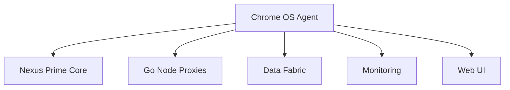

# 💻 Omnitide Chrome OS Agent

[](https://github.com/omnimesh/omnimesh)
[](../LICENSE)
[](../README.md)
[](https://chromeos.dev)

> **Native Chrome OS Agent for Omnitide Compute Fabric Integration**

## 🌟 Overview

The **Omnitide Chrome OS Agent** brings the power of distributed computing to Chrome OS devices, enabling Chromebooks and Chrome OS tablets to participate as intelligent edge nodes in the Omnitide Compute Fabric. This agent leverages Chrome OS's unique architecture and security model to provide secure, efficient, and seamless integration with the broader Omnitide ecosystem.

## 🎯 Vision & Mission

**Vision**: Transform every Chrome OS device into a capable edge computing node that contributes to a global distributed computing network while maintaining Chrome OS's simplicity and security.

**Mission**: Deliver a secure, efficient, and user-friendly agent that enables Chrome OS devices to participate in distributed computing workloads while respecting device limitations and user privacy.

## 🚀 Planned Architecture

### Core Components

#### 🔌 **Chrome Extension Framework**
- **Service Worker**: Background processing and communication management
- **Content Scripts**: Web page integration and user interface
- **Native Messaging**: Communication with native Chrome OS components
- **WebAssembly**: High-performance compute workload execution

#### 🌐 **Progressive Web App (PWA)**
- **Offline Capability**: Service worker-based offline functionality
- **Native Integration**: Chrome OS system integration APIs
- **Real-time Communication**: WebSocket and WebRTC connectivity
- **Local Storage**: IndexedDB and Cache API for data persistence

#### 🛡️ **Security Layer**
- **Chrome OS Integration**: Leveraging Chrome OS security model
- **Sandboxed Execution**: Isolated workload execution environment
- **Certificate Management**: Chrome OS certificate store integration
- **Privacy Controls**: User consent and data handling transparency

#### 📊 **Resource Management**
- **CPU Monitoring**: ARM and x86 CPU utilization tracking
- **Memory Management**: Efficient memory usage within Chrome OS limits
- **Network Optimization**: Bandwidth-aware communication protocols
- **Battery Optimization**: Power-efficient operation for mobile devices

## 🏗️ Technical Specifications

### Chrome OS Architecture
```yaml
Deployment Models:
  - Chrome Extension: Browser-based agent with Manifest V3
  - Progressive Web App: Installable web application
  - Android App: Android subsystem integration (ARC++)
  - Linux App: Crostini/Linux container integration

Chrome APIs:
  - Chrome Extensions API: Background scripts and content scripts
  - Chrome OS API: System-level integration capabilities
  - WebAssembly: High-performance compute workloads
  - Service Workers: Background synchronization and caching

Platform Integration:
  - Chrome OS Device Management: Enterprise device integration
  - Android Runtime: Android app compatibility
  - Linux Container: Crostini development environment
  - Web Platform: Standards-based web technologies
```

### Security Framework
```yaml
Chrome OS Security:
  - Verified Boot: Cryptographic boot verification
  - Sandboxing: Process isolation and privilege separation
  - Automatic Updates: Seamless security updates
  - TPM Integration: Hardware-based security module

Data Protection:
  - Encryption at Rest: Full disk encryption
  - Network Security: TLS 1.3 and certificate pinning
  - Privacy Controls: Granular permission management
  - Audit Logging: Security event logging and monitoring

Compliance:
  - Enterprise Policy: Chrome OS device policy integration
  - Privacy Standards: GDPR and CCPA compliance
  - Security Certifications: Common Criteria and FIPS 140-2
  - Accessibility: WCAG 2.1 AA compliance
```

### Resource Constraints
```yaml
Hardware Limitations:
  - CPU: ARM Cortex-A or Intel Celeron processors
  - Memory: 4-16 GB RAM typical
  - Storage: 32-128 GB eMMC/SSD typical
  - Network: Wi-Fi primary, cellular optional

Chrome OS Limits:
  - Process Limits: Chrome tab and extension limits
  - Memory Limits: Per-tab and per-extension limits
  - Network Limits: Chrome network stack limitations
  - File System: Limited file system access

Optimization Strategies:
  - Lazy Loading: On-demand resource loading
  - Background Sync: Efficient data synchronization
  - Compression: Data and communication compression
  - Caching: Intelligent local caching strategies
```

## 🛠️ Development Roadmap

### Phase 1: Foundation (Q2 2024)
- [ ] **Research & Architecture**
  - [ ] Chrome OS platform capabilities assessment
  - [ ] Chrome extension and PWA architecture design
  - [ ] Security model and privacy framework definition
  - [ ] Performance baseline and optimization targets

- [ ] **Core Development**
  - [ ] Chrome extension Manifest V3 implementation
  - [ ] Basic communication with Omnitide core services
  - [ ] Initial resource monitoring and reporting
  - [ ] User interface and configuration management

### Phase 2: Core Features (Q3-Q4 2024)
- [ ] **Agent Implementation**
  - [ ] Node registration and authentication
  - [ ] Real-time telemetry and health reporting
  - [ ] Basic workload execution capabilities
  - [ ] Local storage and data management

- [ ] **Integration & Testing**
  - [ ] Integration with Nexus Prime Core
  - [ ] Chrome OS device testing across hardware variants
  - [ ] Performance optimization and battery life testing
  - [ ] Security audit and vulnerability assessment

### Phase 3: Advanced Features (Q1-Q2 2025)
- [ ] **Enhanced Capabilities**
  - [ ] WebAssembly workload execution
  - [ ] Distributed task coordination
  - [ ] Edge computing and local processing
  - [ ] Multi-device orchestration

- [ ] **Enterprise Integration**
  - [ ] Chrome OS device management integration
  - [ ] Enterprise policy and compliance
  - [ ] Fleet management and deployment
  - [ ] Advanced monitoring and analytics

### Phase 4: Scale & Innovation (Q3+ 2025)
- [ ] **Advanced Features**
  - [ ] Machine learning edge inference
  - [ ] Collaborative computing with nearby devices
  - [ ] IoT device integration and control
  - [ ] Advanced AI-powered automation

## 📋 Prerequisites

### Development Environment
```bash
# Chrome OS Development
chrome-os-sdk >= 15000.0.0
cros-workon >= 1.0.0

# Web Development
node >= 18.17.0
npm >= 9.6.0
typescript >= 5.2.0

# Chrome Extension Development
chrome >= 120.0.0
chrome-extension-tools >= 1.0.0
web-ext >= 7.8.0

# Testing Tools
puppeteer >= 21.0.0
jest >= 29.7.0
playwright >= 1.40.0
```

### Target Devices
```yaml
Supported Hardware:
  - Chromebooks: ARM64 and x86_64 processors
  - Chrome OS Tablets: ARM64 processors
  - Chromeboxes: x86_64 processors
  - Chrome OS Flex: x86_64 compatible devices

Minimum Requirements:
  - Chrome OS: 88+ (M88 or later)
  - RAM: 4+ GB
  - Storage: 2+ GB available space
  - Network: Wi-Fi or Ethernet connectivity

Recommended Specifications:
  - Chrome OS: Latest stable channel
  - RAM: 8+ GB
  - Storage: 64+ GB with 10+ GB available
  - Network: High-speed Wi-Fi or gigabit Ethernet
```

## 🔧 Quick Start (Future)

```bash
# Clone and setup
git clone https://github.com/omnimesh/omnimesh.git OMNIMESH
cd OMNIMESH/agents-chromeos

# Setup development environment
./scripts/setup-chromeos-dev.sh

# Build Chrome extension
npm run build:extension

# Build PWA
npm run build:pwa

# Load extension in Chrome
npm run load:extension

# Run tests
npm run test

# Deploy to Chrome Web Store
npm run deploy:extension
```

## 📱 Deployment Options

### Chrome Extension
```yaml
Manifest V3:
  - Service Worker: Background script execution
  - Content Scripts: Web page interaction
  - Action API: Browser toolbar integration
  - Permissions: Minimal required permissions

Distribution:
  - Chrome Web Store: Public distribution channel
  - Enterprise Policy: Enterprise deployment
  - Developer Mode: Development and testing
  - Sideloading: Manual installation process

Features:
  - Background Processing: Persistent background execution
  - Native Messaging: Communication with native apps
  - WebAssembly: High-performance computing
  - Storage API: Local data persistence
```

### Progressive Web App
```yaml
Web App Manifest:
  - Installable: Add to shelf functionality
  - Standalone: App-like experience
  - Offline: Service worker offline capability
  - Updates: Automatic app updates

Chrome OS Integration:
  - File Handling: File type association
  - Share Target: Receive shared content
  - Window Controls: Native window management
  - Notifications: System notification integration

Capabilities:
  - WebAssembly: High-performance workloads
  - WebRTC: Peer-to-peer communication
  - IndexedDB: Local database storage
  - Background Sync: Offline synchronization
```

## 🔐 Security & Privacy

### Chrome OS Security Model
```yaml
Sandboxing:
  - Process Isolation: Separate process boundaries
  - Privilege Separation: Minimal privilege principle
  - Site Isolation: Web content isolation
  - Container Security: Secure container execution

Verified Boot:
  - Cryptographic Verification: Boot process verification
  - Tamper Detection: System integrity monitoring
  - Recovery Mode: Automatic system recovery
  - Update Security: Secure update mechanisms

User Data Protection:
  - Encryption: Full disk encryption by default
  - Privacy Controls: Granular privacy settings
  - Data Minimization: Collect only necessary data
  - Transparency: Clear data usage disclosure
```

### Compliance & Standards
```yaml
Privacy Compliance:
  - GDPR: European data protection regulation
  - CCPA: California consumer privacy act
  - COPPA: Children's online privacy protection
  - Chrome OS Privacy: Platform privacy requirements

Security Standards:
  - Chrome Extension Security: Manifest V3 security model
  - Web Security: HTTPS and content security policy
  - Chrome OS Security: Platform security features
  - Enterprise Security: Enterprise security policies
```

## 🌐 Integration Points

### Omnitide Ecosystem


### Chrome OS Platform
```yaml
System Integration:
  - Chrome OS Device API: System-level capabilities
  - Android Runtime: Android app compatibility
  - Linux Container: Crostini integration
  - Web Platform: Standards-based technologies

Enterprise Integration:
  - Chrome Browser Cloud Management: Device policies
  - Google Workspace: Enterprise productivity suite
  - Chrome OS Device Management: Fleet management
  - Enterprise Policies: Organizational controls

Third-Party Integration:
  - Cloud Services: Multi-cloud connectivity
  - IoT Devices: Local device communication
  - Edge Services: Edge computing integration
  - Development Tools: Developer ecosystem
```

## 📊 Performance Optimization

### Resource Efficiency
```yaml
CPU Optimization:
  - Web Workers: Background thread processing
  - WebAssembly: Near-native performance
  - Lazy Loading: On-demand resource loading
  - Throttling: Adaptive performance scaling

Memory Management:
  - Garbage Collection: Efficient memory cleanup
  - Object Pooling: Memory allocation optimization
  - Caching Strategies: Intelligent data caching
  - Memory Monitoring: Real-time usage tracking

Network Optimization:
  - Compression: Data compression algorithms
  - Multiplexing: Connection reuse and pooling
  - Caching: HTTP and application-level caching
  - Bandwidth Adaptation: Network-aware protocols
```

### Battery Life
```yaml
Power Management:
  - Background Throttling: Reduced background activity
  - Sleep Modes: Intelligent sleep and wake cycles
  - Network Efficiency: Optimized network usage
  - CPU Scaling: Dynamic frequency scaling

User Experience:
  - Responsive Design: Fast user interactions
  - Progressive Loading: Incremental content loading
  - Offline Capability: Reduced network dependency
  - Adaptive Features: Context-aware functionality
```

## 🤝 Contributing

We welcome contributions from Chrome OS developers, web developers, and edge computing enthusiasts! See our [Contributing Guide](../CONTRIBUTING.md) for:

- **Chrome Extension Development**: Manifest V3 best practices and implementation
- **Progressive Web App Development**: Modern web app features and optimization
- **Chrome OS Integration**: Platform-specific features and capabilities
- **Security & Privacy**: Security model implementation and privacy protection

## 📚 Resources & Learning

### Chrome OS Development
- **Chrome OS Dev**: [ChromeOS.dev](https://chromeos.dev)
- **Chrome Extensions**: [Chrome Extension Docs](https://developer.chrome.com/docs/extensions/)
- **Progressive Web Apps**: [PWA Documentation](https://web.dev/progressive-web-apps/)
- **Chrome OS Enterprise**: [Chrome Enterprise](https://cloud.google.com/chrome-enterprise)

### Web Technologies
- **WebAssembly**: [WebAssembly.org](https://webassembly.org)
- **Service Workers**: [Service Worker API](https://developer.mozilla.org/en-US/docs/Web/API/Service_Worker_API)
- **IndexedDB**: [IndexedDB API](https://developer.mozilla.org/en-US/docs/Web/API/IndexedDB_API)
- **WebRTC**: [WebRTC Documentation](https://webrtc.org)

## 🛠️ Development Tools

### Chrome OS Specific
```yaml
Development Environment:
  - Chrome OS SDK: Official development toolkit
  - Crostini: Linux development environment
  - Chrome DevTools: Browser debugging tools
  - Remote Debugging: Device debugging capabilities

Testing Tools:
  - Chrome OS Test Lab: Device testing infrastructure
  - Puppeteer: Automated browser testing
  - Lighthouse: Performance and accessibility auditing
  - WebPageTest: Performance testing tools

Deployment Tools:
  - Chrome Web Store: Extension distribution
  - Enterprise Policy: Enterprise deployment
  - Chrome OS Device Management: Fleet management
  - Analytics: Usage and performance analytics
```

## 🆘 Support & Documentation

### Getting Help
- **Documentation**: [Chrome OS Agent Docs](https://docs.omnimesh.ai/agents-chromeos)
- **Community**: [Discord](https://discord.gg/omnimesh) #chromeos-agent channel
- **Issues**: [GitHub Issues](https://github.com/omnimesh/omnimesh/issues)
- **Chrome OS Community**: [Chrome OS Developer Community](https://chromeos.dev/en/community)

### Training & Resources
- **Chrome OS Developer**: Platform development certification
- **Web Developer**: Modern web development training
- **Edge Computing**: Distributed systems and edge computing

---

## 🔮 Future Vision

The Omnitide Chrome OS Agent represents the future of edge computing on educational and enterprise devices:

- **Ubiquitous Computing**: Every Chromebook becomes a compute node
- **Educational Integration**: STEM education and computational thinking
- **Enterprise Edge**: Distributed enterprise computing capabilities
- **Sustainable Computing**: Energy-efficient edge processing

**"Transforming millions of Chrome OS devices into a powerful, secure, and accessible distributed computing network."**

---

*For more information about the overall Omnitide project, see the [main README](../README.md) and [OMNITIDE CODEX](../OMNITIDE_CODEX.md).*
