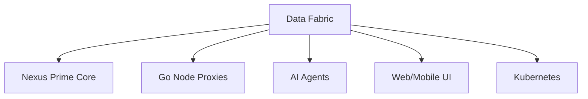

# 🕸️ Omnitide Data Fabric

[](https://github.com/omnimesh/omnimesh)
[](../LICENSE)
[](../README.md)

> **Next-Generation Distributed Data Mesh for Edge-to-Cloud Computing**

## 🌟 Overview

The **Omnitide Data Fabric** is the foundational data layer that enables seamless, secure, and intelligent data exchange across the entire Omnitide Compute Fabric. It implements a modern data mesh architecture that treats data as a first-class citizen, providing real-time streaming, batch processing, and intelligent caching across distributed edge and cloud environments.

## 🎯 Vision & Mission

**Vision**: Create the world's most advanced distributed data fabric that unifies edge computing, cloud resources, and AI workloads through intelligent data orchestration.

**Mission**: Deliver a zero-trust, self-optimizing data mesh that enables real-time insights, autonomous decision-making, and seamless data mobility across any computing environment.

## 🚀 Planned Architecture

### Core Components

#### 🌊 **Streaming Data Engine**
- **Real-time Streams**: Apache Kafka/Pulsar-based event streaming
- **Stream Processing**: Apache Flink/Apache Beam for real-time analytics
- **Event Sourcing**: Immutable event logs with replay capabilities
- **Schema Evolution**: Backward/forward compatible schema management

#### 🗄️ **Distributed Storage Layer**
- **Object Storage**: S3-compatible distributed object storage
- **Time Series**: InfluxDB/TimescaleDB for metrics and telemetry
- **Graph Storage**: Neo4j/TigerGraph for relationship data
- **Vector Storage**: Pinecone/Weaviate for AI/ML embeddings

#### 🚀 **Data Processing Framework**
- **Batch Processing**: Apache Spark/Ray for large-scale data processing
- **Stream Processing**: Real-time analytics and transformations
- **ML Pipeline**: Automated feature engineering and model training
- **Data Quality**: Automated validation, profiling, and monitoring

#### 🔒 **Security & Governance**
- **Zero Trust**: End-to-end encryption with mTLS
- **Data Lineage**: Complete audit trails and provenance tracking
- **Access Control**: Fine-grained RBAC and attribute-based access
- **Compliance**: GDPR, HIPAA, SOC 2 compliance automation

## 🏗️ Technical Specifications

### Data Streaming Stack
```yaml
Message Brokers:
  - Apache Kafka 3.5+ (primary)
  - Apache Pulsar 3.0+ (alternative)
  - NATS Streaming (lightweight edge)
  - Redis Streams (caching layer)

Stream Processing:
  - Apache Flink 1.17+ (real-time)
  - Apache Beam 2.48+ (unified batch/stream)
  - Kafka Streams (lightweight processing)
  - Benthos (data transformation)

Schema Management:
  - Confluent Schema Registry
  - Apache Avro / Protocol Buffers
  - JSON Schema validation
  - Automatic schema evolution
```

### Storage Technologies
```yaml
Object Storage:
  - MinIO (S3-compatible)
  - Apache Ozone (HDFS evolution)
  - SeaweedFS (distributed file system)
  - Ceph (unified storage)

Time Series:
  - TimescaleDB (PostgreSQL extension)
  - InfluxDB 3.0+ (cloud-native)
  - VictoriaMetrics (high-performance)
  - QuestDB (high-frequency data)

Document/Graph:
  - MongoDB 7.0+ (document store)
  - Neo4j 5.0+ (graph database)
  - TigerGraph (real-time graph analytics)
  - ArangoDB (multi-model)

Vector/AI:
  - Pinecone (managed vector DB)
  - Weaviate (open-source vector DB)
  - Qdrant (Rust-based vector engine)
  - pgvector (PostgreSQL extension)
```

### Data Processing
```yaml
Batch Processing:
  - Apache Spark 3.4+ (distributed computing)
  - Ray 2.5+ (ML/AI workloads)
  - Dask (Python-native scaling)
  - Apache Beam (unified processing)

Real-time Analytics:
  - Apache Flink (stream processing)
  - ksqlDB (SQL on Kafka)
  - Apache Druid (OLAP queries)
  - ClickHouse (analytical database)

Data Pipeline:
  - Apache Airflow 2.6+ (workflow orchestration)
  - Prefect (modern data orchestration)
  - Dagster (data-aware orchestration)
  - Temporal (distributed workflows)
```

## 🛠️ Development Roadmap

### Phase 1: Core Infrastructure (Q2 2024)
- [ ] **Streaming Foundation**
  - [ ] Multi-broker streaming architecture (Kafka, Pulsar, NATS)
  - [ ] Schema registry and evolution management
  - [ ] Cross-region replication and failover
  - [ ] Performance benchmarking and optimization

- [ ] **Storage Layer**
  - [ ] Distributed object storage deployment
  - [ ] Time series database cluster setup
  - [ ] Multi-model database integration
  - [ ] Automated backup and disaster recovery

### Phase 2: Data Processing (Q3-Q4 2024)
- [ ] **Real-time Processing**
  - [ ] Stream processing framework deployment
  - [ ] Real-time analytics pipelines
  - [ ] Event-driven architecture patterns
  - [ ] Stream-table joins and aggregations

- [ ] **Batch Processing**
  - [ ] Distributed computing cluster setup
  - [ ] ETL/ELT pipeline automation
  - [ ] Data quality and validation frameworks
  - [ ] Machine learning pipeline integration

### Phase 3: Advanced Features (Q1-Q2 2025)
- [ ] **AI/ML Integration**
  - [ ] Automated feature stores
  - [ ] Real-time model serving
  - [ ] ML experiment tracking
  - [ ] AutoML pipeline automation

- [ ] **Data Mesh Architecture**
  - [ ] Domain-driven data products
  - [ ] Self-serve data infrastructure
  - [ ] Federated governance model
  - [ ] Data contract automation

### Phase 4: Enterprise & Scale (Q3+ 2025)
- [ ] **Multi-Cloud Data Fabric**
  - [ ] Cross-cloud data synchronization
  - [ ] Hybrid edge-cloud architectures
  - [ ] Global data distribution strategies
  - [ ] Cost optimization across providers

## 📋 Prerequisites

### Infrastructure Requirements
```bash
# Core Technologies
kubernetes >= 1.27.0
helm >= 3.12.0
istio >= 1.18.0 (service mesh)
cert-manager >= 1.12.0

# Storage
persistent-volumes >= 10TB
high-iops-storage (NVMe recommended)
network-attached-storage (optional)

# Networking
high-bandwidth-networking >= 10Gbps
low-latency-networking < 1ms (intra-cluster)
```

### Compute Resources
```yaml
Development Environment:
  - CPU: 32+ cores (ARM64 or x86_64)
  - Memory: 64+ GB RAM
  - Storage: 2+ TB NVMe SSD
  - Network: 1+ Gbps bandwidth

Production Environment:
  - CPU: 128+ cores distributed
  - Memory: 512+ GB RAM per node
  - Storage: 50+ TB distributed storage
  - Network: 10+ Gbps bandwidth
  - GPU: Optional for ML workloads
```

## 🔧 Quick Start (Future)

```bash
# Clone and setup
git clone https://github.com/omnimesh/omnimesh.git OMNIMESH
cd OMNIMESH/data-fabric

# Setup development environment
./scripts/setup-data-fabric.sh

# Deploy core components
make deploy-streaming
make deploy-storage
make deploy-processing

# Verify installation
make verify-data-fabric

# Run sample data pipelines
make demo-pipelines
```

## 📊 Key Metrics & KPIs

### Performance Metrics
- **Throughput**: 1M+ messages/second per cluster
- **Latency**: <10ms for real-time processing
- **Availability**: 99.99% uptime with automatic failover
- **Scalability**: Linear scaling to 1000+ nodes

### Data Quality Metrics
- **Accuracy**: >99.9% data quality scores
- **Completeness**: <0.1% missing data rates
- **Consistency**: Real-time data validation
- **Timeliness**: <100ms end-to-end latency

### Business Metrics
- **Cost Efficiency**: 40-60% reduction in data infrastructure costs
- **Time to Insight**: 90% reduction in analytics delivery time
- **Developer Productivity**: Self-serve data access
- **Compliance**: Automated governance and audit trails

## 🏛️ Data Architecture Patterns

### Event-Driven Architecture
```yaml
Event Sourcing:
  - Immutable event logs
  - Replay capabilities
  - Audit trail preservation
  - Temporal data queries

CQRS (Command Query Responsibility Segregation):
  - Separate read/write models
  - Optimized query performance
  - Scalable write operations
  - Event-driven synchronization

Saga Pattern:
  - Distributed transaction management
  - Compensation logic
  - Long-running processes
  - Fault tolerance
```

### Data Mesh Principles
```yaml
Domain Ownership:
  - Business domain data products
  - Self-contained data teams
  - Clear data contracts
  - Independent deployment

Self-Serve Infrastructure:
  - Platform abstraction
  - Developer-friendly APIs
  - Automated provisioning
  - Standardized tooling

Federated Governance:
  - Decentralized decision making
  - Global standards enforcement
  - Automated compliance checking
  - Quality gates automation

Data as a Product:
  - Product thinking for data
  - User experience focus
  - SLA-driven development
  - Continuous improvement
```

## 🔒 Security & Compliance

### Data Security
- **Encryption**: End-to-end encryption at rest and in transit
- **Access Control**: Fine-grained RBAC and ABAC
- **Data Masking**: PII protection and anonymization
- **Audit Logging**: Complete access and modification trails

### Compliance Standards
- **GDPR**: Right to be forgotten, data portability
- **HIPAA**: Healthcare data protection
- **SOC 2**: Security and availability controls
- **PCI DSS**: Payment data protection

### Privacy Protection
- **Differential Privacy**: Statistical privacy protection
- **Homomorphic Encryption**: Computation on encrypted data
- **Secure Multi-party Computation**: Collaborative analytics
- **Zero-Knowledge Proofs**: Privacy-preserving verification

## 🌐 Integration Ecosystem

### Omnitide Components


### External Systems
- **Cloud Providers**: AWS, Azure, GCP native services
- **Data Sources**: APIs, databases, files, streams
- **Analytics Tools**: Tableau, PowerBI, Looker integration
- **ML Platforms**: MLflow, Kubeflow, SageMaker

## 📈 Performance Optimization

### Caching Strategies
```yaml
Multi-Level Caching:
  - L1: In-memory (Redis)
  - L2: SSD-based (RocksDB)
  - L3: Network storage
  - CDN: Global edge caching

Cache Patterns:
  - Write-through
  - Write-behind
  - Cache-aside
  - Refresh-ahead
```

### Data Partitioning
```yaml
Partitioning Strategies:
  - Time-based partitioning
  - Hash-based distribution
  - Range-based partitioning
  - Composite partitioning

Sharding Patterns:
  - Horizontal sharding
  - Vertical sharding
  - Functional sharding
  - Directory-based sharding
```

## 🤝 Contributing

We welcome contributions from data engineers, architects, and researchers! See our [Contributing Guide](../CONTRIBUTING.md) for:

- **Architecture Contributions**: Data mesh patterns and best practices
- **Code Contributions**: Connectors, transformations, and optimizations
- **Documentation**: Tutorials, guides, and reference materials
- **Testing**: Performance benchmarks and integration tests

## 📚 Research & Standards

### Academic Research
- **Data Mesh**: Distributed data architecture patterns
- **Event Sourcing**: Immutable data modeling
- **CRDT**: Conflict-free replicated data types
- **CAP Theorem**: Consistency, availability, partition tolerance

### Industry Standards
- **Apache Arrow**: Columnar in-memory analytics
- **OpenAPI**: API specification standards
- **AsyncAPI**: Event-driven API documentation
- **CloudEvents**: Event data specification

## 🛠️ Monitoring & Observability

### Data Observability
```yaml
Data Quality Monitoring:
  - Automated data profiling
  - Anomaly detection
  - Data drift monitoring
  - Quality score dashboards

Pipeline Monitoring:
  - End-to-end latency tracking
  - Throughput monitoring
  - Error rate analysis
  - SLA compliance tracking

Cost Monitoring:
  - Resource utilization tracking
  - Cost attribution by domain
  - Optimization recommendations
  - Budget alerts and controls
```

### Alerting & Incident Response
- **Smart Alerting**: ML-powered anomaly detection
- **Automated Remediation**: Self-healing data pipelines
- **Incident Management**: Integration with PagerDuty/Opsgenie
- **Post-Incident Analysis**: Automated root cause analysis

## 🆘 Support & Documentation

### Getting Help
- **Documentation**: [Data Fabric Docs](https://docs.omnimesh.ai/data-fabric)
- **Community**: [Discord](https://discord.gg/omnimesh) #data-fabric channel
- **Issues**: [GitHub Issues](https://github.com/omnimesh/omnimesh/issues)
- **Best Practices**: [Data Engineering Guide](https://guides.omnimesh.ai/data)

### Training & Certification
- **Data Engineer**: Professional certification program
- **Data Architect**: Advanced design patterns course
- **Platform Engineer**: Infrastructure automation training

---

## 🔮 Future Vision

The Omnitide Data Fabric represents the future of distributed data architecture:

- **Self-Optimizing**: Automatic performance tuning and resource allocation
- **Self-Healing**: Autonomous failure detection and recovery
- **Self-Scaling**: Dynamic scaling based on demand patterns
- **Self-Securing**: Continuous security monitoring and threat response

**"Building the data infrastructure that developers dream of - simple to use, infinitely scalable, and secure by default."**

---

*For more information about the overall Omnitide project, see the [main README](../README.md) and [OMNITIDE CODEX](../OMNITIDE_CODEX.md).*
