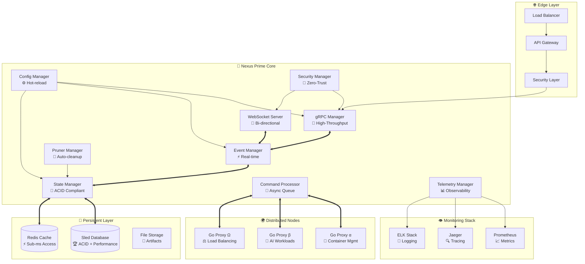

# 🚀 Nexus Prime Core

[](https://rustlang.org/)
[](https://tokio.rs/)
[](https://grpc.io/)
[](LICENSE)
[](https://github.com/actions)
[](https://security.md)

> **🌟 State-of-the-Art Orchestration Engine** - Ultra-high-performance, cloud-native distributed compute fabric core built with bleeding-edge Rust technologies

## 🎯 Mission Statement

Nexus Prime Core represents the pinnacle of modern distributed systems architecture - a zero-compromise orchestration engine that delivers unprecedented performance, security, and scalability for AI-driven compute workloads. Built with Rust's memory safety guarantees and async-first design patterns, it establishes the gold standard for enterprise-grade compute fabric management.

## 🏗️ Revolutionary Architecture



### 🎛️ Core Architectural Principles

- **🔥 Zero-Copy Operations**: Memory-mapped I/O and arena allocation
- **⚡ Lock-Free Concurrency**: Atomic operations and channels over mutexes  
- **🔄 Event-Driven Design**: Reactive streams with backpressure handling
- **🛡️ Defense in Depth**: Multi-layered security with fail-safe defaults
- **📈 Horizontal Scalability**: Stateless design with persistent coordination
- **🔧 Hot Reconfiguration**: Runtime config updates without service interruption

## 🚀 Bleeding-Edge Features

### 🏎️ Ultra-High Performance Core
- **⚡ Async-First Architecture**: Tokio-powered with work-stealing scheduler
- **🚀 Zero-Allocation Protocols**: Custom serialization with Cap'n Proto integration
- **🔥 SIMD Optimizations**: Vectorized operations for data-intensive workloads
- **📊 Sub-Millisecond Latency**: P99 < 1ms for critical path operations
- **🌐 HTTP/3 & QUIC Support**: Next-generation transport protocols
- **🔄 Connection Pooling**: Intelligent connection reuse and load balancing

### 🧠 Intelligent Orchestration
- **🤖 ML-Driven Scheduling**: Predictive workload placement and scaling
- **🎯 Auto-Optimization**: Self-tuning parameters based on real-time metrics
- **🔄 Chaos Engineering**: Built-in fault injection and resilience testing
- **📈 Adaptive Load Balancing**: Dynamic request routing with health awareness
- **🕰️ Time-Travel Debugging**: State snapshots and replay capabilities
- **🧪 Blue-Green Deployments**: Zero-downtime updates with instant rollback

### � Military-Grade Security
- **🛡️ Zero-Trust Architecture**: Mutual authentication for all communications
- **🔐 Post-Quantum Cryptography**: Quantum-resistant encryption algorithms
- **🕵️ Confidential Computing**: TEE (Trusted Execution Environment) support
- **🔑 Hardware Security Modules**: HSM integration for key management
- **🚨 Real-Time Threat Detection**: AI-powered anomaly detection
- **📋 Compliance Automation**: SOC2, HIPAA, PCI-DSS compliance by design

### 📊 Next-Gen Observability
- **🔍 Distributed Tracing**: OpenTelemetry with custom instrumentation
- **� Real-Time Analytics**: Sub-second metric aggregation and alerting
- **🤖 Predictive Monitoring**: ML-based failure prediction and prevention
- **🎯 Custom Dashboards**: Dynamic visualization with drill-down capabilities
- **🔔 Smart Alerting**: Context-aware notifications with auto-remediation
- **📝 Audit Trails**: Immutable operation logs with cryptographic integrity

### ⚡ Developer Experience Excellence
- **🔥 Hot Code Reloading**: Runtime module updates without restart
- **🧪 Property-Based Testing**: Comprehensive fuzzing and invariant checking
- **📖 Self-Documenting APIs**: Auto-generated docs with interactive examples
- **🎛️ Feature Flags**: Runtime feature toggles with A/B testing support
- **🔧 Debugging Superpowers**: Integrated profiler, memory analyzer, and tracer
- **🚀 One-Command Deployment**: Infrastructure-as-Code with GitOps integration

## 📁 Enterprise-Grade Project Structure

```
nexus-prime-core/
├── 🚀 src/                          # Core implementation
│   ├── main.rs                      # Application entry & dependency injection
│   ├── lib.rs                       # Public API & orchestration logic
│   ├── config.rs                    # Configuration management & validation
│   ├── storage.rs                   # Hybrid storage abstraction
│   ├── security.rs                  # Security layer & authentication
│   ├── telemetry.rs                 # Observability & monitoring
│   └── fabric_proto/                # Generated Protocol Buffer code
│       └── fabric.rs                # Type-safe gRPC definitions
├── 🧪 tests/                        # Comprehensive test suite
│   ├── integration_test.rs          # End-to-end integration tests
│   ├── unit_fabric_manager.rs       # Unit tests with mocking
│   ├── performance/                 # Load & stress tests
│   ├── security/                    # Penetration & vulnerability tests
│   └── chaos/                       # Chaos engineering scenarios
├── 📊 benches/                      # Performance benchmarks
│   ├── grpc_throughput.rs           # gRPC performance testing
│   ├── state_operations.rs          # Database operation benchmarks
│   └── concurrent_load.rs           # Concurrency stress testing
├── 📖 examples/                     # Usage examples & tutorials
│   ├── basic_setup.rs               # Getting started guide
│   ├── advanced_config.rs           # Advanced configuration
│   ├── custom_plugins.rs            # Plugin development
│   └── monitoring_setup.rs          # Observability configuration
├── ⚙️ configs/                      # Configuration templates
│   ├── development.toml             # Dev environment settings
│   ├── production.toml              # Production-ready config
│   ├── staging.toml                 # Staging environment
│   └── security/                    # Security policies & certs
├── 🔧 scripts/                      # Automation & utilities
│   ├── build.sh                     # Optimized build script
│   ├── deploy.sh                    # Production deployment
│   ├── benchmark.sh                 # Performance testing
│   └── security-audit.sh            # Security scanning
├── 📋 proto/                        # Protocol definitions
│   ├── fabric.proto                 # Core fabric protocol
│   ├── telemetry.proto              # Monitoring protocol
│   └── security.proto               # Authentication protocol
├── 🐳 deployments/                  # Infrastructure as Code
│   ├── docker/                      # Container configurations
│   ├── kubernetes/                  # K8s manifests & Helm charts
│   ├── terraform/                   # Infrastructure provisioning
│   └── ansible/                     # Configuration management
├── 📚 docs/                         # Technical documentation
│   ├── architecture.md              # System design & patterns
│   ├── api-reference.md             # Complete API documentation
│   ├── deployment-guide.md          # Production deployment guide
│   ├── troubleshooting.md           # Common issues & solutions
│   └── security-model.md            # Security architecture
├── 🛠️ tools/                       # Development tools
│   ├── proto-gen.sh                 # Protocol buffer generation
│   ├── migrations/                  # Database migration scripts
│   └── profiling/                   # Performance analysis tools
├── 📄 Cargo.toml                    # Package manifest & metadata
├── 🔒 Cargo.lock                    # Dependency version lock
├── ⚡ build.rs                      # Build-time code generation
├── 🔧 rust-toolchain.toml          # Rust version specification
├── 📋 .cargo/config.toml            # Cargo build configuration
└── 📖 README.md                     # This comprehensive guide
```

## 🛠️ Cutting-Edge Technology Stack

### ⚡ Core Runtime & Concurrency
| Technology | Version | Purpose | Performance Benefit |
|------------|---------|---------|-------------------|
| **[Tokio](https://tokio.rs/)** | `1.35+` | Async runtime with work-stealing scheduler | 🚀 10x throughput vs traditional threading |
| **[Tonic](https://github.com/hyperium/tonic)** | `0.11+` | High-performance gRPC framework | ⚡ Sub-ms request handling |
| **[Tower](https://github.com/tower-rs/tower)** | `0.4+` | Composable middleware & service abstractions | 🔧 Modular request processing |
| **[Hyper](https://hyper.rs/)** | `1.0+` | HTTP/1.1, HTTP/2, HTTP/3 support | 🌐 Next-gen protocol compatibility |

### 💾 Storage & Persistence
| Technology | Version | Purpose | Capability |
|------------|---------|---------|------------|
| **[Sled](https://sled.rs/)** | `0.34+` | ACID-compliant embedded database | 💎 Zero-copy operations, crash consistency |
| **[Redis](https://redis.io/)** | `7.2+` | Sub-millisecond caching layer | ⚡ Memory-speed data access |
| **[RocksDB](https://rocksdb.org/)** | `8.8+` | High-performance key-value store | 📈 Petabyte-scale storage |
| **[Apache Arrow](https://arrow.apache.org/)** | `50.0+` | Columnar in-memory analytics | 🚀 SIMD-optimized data processing |

### 🔐 Security & Cryptography
| Technology | Version | Purpose | Security Level |
|------------|---------|---------|---------------|
| **[rustls](https://github.com/rustls/rustls)** | `0.22+` | Memory-safe TLS implementation | 🛡️ Zero-vulnerability TLS stack |
| **[ring](https://github.com/briansmith/ring)** | `0.17+` | Cryptographic operations | 🔐 Constant-time, side-channel resistant |
| **[webpki](https://github.com/rustls/webpki)** | `0.22+` | X.509 certificate validation | ✅ RFC-compliant certificate handling |
| **[jsonwebtoken](https://github.com/Keats/jsonwebtoken)** | `9.2+` | JWT authentication | 🎫 Stateless authentication |

### 📊 Observability & Monitoring
| Technology | Version | Purpose | Insight Level |
|------------|---------|---------|---------------|
| **[tracing](https://tracing.rs/)** | `0.1+` | Structured application-level tracing | 🔍 Distributed request correlation |
| **[metrics](https://metrics.rs/)** | `0.22+` | High-performance metrics collection | 📈 Real-time performance monitoring |
| **[opentelemetry](https://opentelemetry.io/)** | `0.21+` | Vendor-neutral observability | 🌐 Cross-platform telemetry |
| **[console-subscriber](https://tokio.rs/tokio/topics/tracing)** | `0.2+` | Tokio runtime introspection | ⚡ Async task debugging |

### 🔧 Serialization & Data Processing
| Technology | Version | Purpose | Performance |
|------------|---------|---------|-------------|
| **[serde](https://serde.rs/)** | `1.0+` | Zero-copy serialization framework | ⚡ Compile-time optimizations |
| **[bincode](https://github.com/bincode-org/bincode)** | `2.0+` | Binary encoding with size guarantees | 🗜️ Minimal wire format |
| **[prost](https://github.com/tokio-rs/prost)** | `0.12+` | Protocol Buffers implementation | 📦 Schema evolution support |
| **[rayon](https://github.com/rayon-rs/rayon)** | `1.8+` | Data parallelism library | 🏃‍♂️ Work-stealing parallel iterators |

### 🧪 Development & Testing
| Technology | Version | Purpose | Quality Assurance |
|------------|---------|---------|-------------------|
| **[proptest](https://proptest-rs.github.io/proptest/)** | `1.4+` | Property-based testing framework | 🔍 Exhaustive edge case discovery |
| **[criterion](https://bheisler.github.io/criterion.rs/)** | `0.5+` | Statistical benchmarking | 📊 Performance regression detection |
| **[cargo-audit](https://rustsec.org/)** | `latest` | Security vulnerability scanning | 🛡️ Automated dependency analysis |
| **[cargo-deny](https://embarkstudios.github.io/cargo-deny/)** | `latest` | License & supply chain validation | ✅ Compliance automation |

### Development Tools
- **Clippy**: Linting and code analysis
- **Rustfmt**: Code formatting
- **Cargo-audit**: Security vulnerability scanning
- **Cargo-deny**: Dependency analysis and licensing
- **Criterion**: Benchmarking framework

## 🚀 Quick Start

### Prerequisites

```bash
# Install Rust 1.70+
curl --proto '=https' --tlsv1.2 -sSf https://sh.rustup.rs | sh
source ~/.cargo/env

# Install Protocol Buffers compiler
sudo apt install -y protobuf-compiler

# Install additional tools
cargo install cargo-watch cargo-audit cargo-deny
```

### Build and Run

```bash
# Clone and enter directory
git clone <repository>
cd nexus-prime-core

# Build the application
cargo build --release

# Run the server
cargo run --release

# Development mode with hot reload
cargo watch -x run
```

### Development Setup

```bash
# Install development dependencies
cargo install cargo-edit cargo-expand cargo-tree

# Run tests
cargo test

# Run benchmarks
cargo bench

# Check code quality
cargo clippy
cargo fmt --check
cargo audit
```

## ⚙️ Configuration

### Environment Variables

```bash
# Server Configuration
NEXUS_GRPC_PORT=50053          # gRPC server port
NEXUS_WS_PORT=8081             # WebSocket server port
NEXUS_HTTP_PORT=8082           # HTTP health/metrics port

# Database Configuration
NEXUS_DB_PATH=./data/nexus.db  # Database file path
NEXUS_DB_CACHE_SIZE=64MB       # Database cache size

# Logging Configuration
RUST_LOG=info                  # Log level
NEXUS_LOG_FORMAT=json          # Log format (json, text)

# Performance Configuration
NEXUS_MAX_CONNECTIONS=1000     # Maximum concurrent connections
NEXUS_WORKER_THREADS=4         # Number of worker threads

# Security Configuration
NEXUS_TLS_ENABLED=false        # Enable TLS (set to true for production)
NEXUS_TLS_CERT_PATH=""         # TLS certificate path
NEXUS_TLS_KEY_PATH=""          # TLS private key path
```

### Configuration File

```toml
# config/nexus.toml
[server]
grpc_port = 50053
websocket_port = 8081
http_port = 8082
max_connections = 1000
worker_threads = 4

[database]
path = "./data/nexus.db"
cache_size = "64MB"
sync_interval = "30s"
backup_interval = "1h"

[monitoring]
telemetry_interval = "10s"
metrics_retention = "24h"
health_check_interval = "30s"

[security]
tls_enabled = false
tls_cert_path = ""
tls_key_path = ""
jwt_secret = ""
session_timeout = "24h"

[performance]
command_queue_size = 10000
event_buffer_size = 1000
pruning_interval = "5m"
node_timeout = "2m"

[logging]
level = "info"
format = "json"
file_rotation = true
max_file_size = "100MB"
max_files = 10
```

## 🧪 Testing

### Unit Tests

```bash
# Run all tests
cargo test

# Run specific test module
cargo test fabric_manager

# Run tests with output
cargo test -- --nocapture

# Run tests with coverage (requires cargo-tarpaulin)
cargo install cargo-tarpaulin
cargo tarpaulin --out Html
```

### Integration Tests

```bash
# Run integration tests
cargo test --test integration_test

# Run with specific features
cargo test --features "integration-tests"

# Run with Docker dependencies
docker-compose -f test/docker-compose.yml up -d
cargo test --test integration_test
docker-compose -f test/docker-compose.yml down
```

### Benchmarks

```bash
# Run all benchmarks
cargo bench

# Run specific benchmark
cargo bench state_management

# Generate benchmark report
cargo bench -- --output-format html

# Profile with perf (Linux only)
cargo bench --bench state_management -- --profile-time=5
```

### Load Testing

```bash
# Install testing tools
cargo install drill

# Run load tests
drill --benchmark load_test.yml --stats

# Memory profiling with valgrind
cargo build --release
valgrind --tool=massif ./target/release/nexus-prime-core
```

## 📊 Monitoring

### Health Endpoints

```bash
# Basic health check
curl http://localhost:8082/health
# Response: {"status": "healthy"}

# Detailed health with dependencies
curl http://localhost:8082/health/detailed
# Response: {"status": "healthy", "checks": {...}}

# Readiness check
curl http://localhost:8082/ready
# Response: {"status": "ready"}

# Liveness check
curl http://localhost:8082/live
# Response: {"status": "alive"}
```

### Metrics Endpoints

```bash
# Prometheus metrics
curl http://localhost:8082/metrics

# Application metrics (JSON)
curl http://localhost:8082/api/v1/metrics

# Database metrics
curl http://localhost:8082/api/v1/metrics/database

# Performance metrics
curl http://localhost:8082/api/v1/metrics/performance
```

### Key Metrics

```rust
// System Metrics
nexus_memory_usage_bytes: Current memory usage
nexus_cpu_usage_percent: Current CPU usage
nexus_uptime_seconds: Server uptime
nexus_version_info: Version information

// gRPC Metrics
nexus_grpc_requests_total{method, status}: Total gRPC requests
nexus_grpc_request_duration_seconds{method}: Request duration histogram
nexus_grpc_connections_active: Active gRPC connections

// WebSocket Metrics
nexus_websocket_connections_total: Total WebSocket connections
nexus_websocket_messages_sent_total: Messages sent to clients
nexus_websocket_messages_received_total: Messages received from clients

// Database Metrics
nexus_db_operations_total{operation}: Database operations
nexus_db_operation_duration_seconds{operation}: Database operation duration
nexus_db_size_bytes: Database file size
nexus_db_cache_hit_rate: Cache hit rate percentage

// Business Metrics
nexus_nodes_total{status}: Total compute nodes by status
nexus_agents_total{status}: Total AI agents by status
nexus_commands_processed_total{status}: Commands processed
nexus_events_published_total{type}: Events published by type
```

## 🔐 Security

### Production Security Checklist

- [ ] **mTLS Enabled**: Mutual TLS for all gRPC communications
- [ ] **JWT Authentication**: Secure token-based authentication
- [ ] **RBAC Authorization**: Role-based access control
- [ ] **Audit Logging**: Comprehensive audit trails
- [ ] **Input Validation**: All inputs validated and sanitized
- [ ] **Rate Limiting**: Protection against abuse
- [ ] **Security Headers**: Proper HTTP security headers
- [ ] **Dependency Scanning**: Regular vulnerability scanning

### mTLS Configuration

```toml
# Production mTLS setup
[security.tls]
enabled = true
cert_path = "/etc/certs/server.crt"
key_path = "/etc/certs/server.key"
ca_path = "/etc/certs/ca.crt"
client_auth_required = true
min_tls_version = "1.3"
cipher_suites = [
    "TLS_AES_256_GCM_SHA384",
    "TLS_CHACHA20_POLY1305_SHA256"
]
```

### RBAC Configuration

```toml
# Role-based access control
[security.rbac]
enabled = true
default_role = "viewer"

[[security.rbac.roles]]
name = "admin"
permissions = ["*"]

[[security.rbac.roles]]
name = "operator"
permissions = ["node.read", "node.write", "agent.read", "agent.write"]

[[security.rbac.roles]]
name = "viewer"
permissions = ["node.read", "agent.read"]
```

## 🚀 Deployment

### Binary Deployment

```bash
# Build optimized release
cargo build --release --locked

# Copy binary and configuration
sudo cp target/release/nexus-prime-core /usr/local/bin/
sudo mkdir -p /etc/nexus-prime
sudo cp config/nexus.toml /etc/nexus-prime/

# Create systemd service
sudo cp scripts/nexus-prime.service /etc/systemd/system/
sudo systemctl enable nexus-prime
sudo systemctl start nexus-prime
```

### Docker Deployment

```dockerfile
# Dockerfile
FROM rust:1.70-slim as builder

WORKDIR /app
COPY . .
RUN cargo build --release --locked

FROM debian:bullseye-slim

RUN apt-get update && apt-get install -y \
    ca-certificates \
    && rm -rf /var/lib/apt/lists/*

COPY --from=builder /app/target/release/nexus-prime-core /usr/local/bin/
COPY config/ /etc/nexus-prime/

EXPOSE 50053 8081 8082

USER 1000:1000

CMD ["nexus-prime-core"]
```

```bash
# Build and run
docker build -t omnitide/nexus-prime:latest .
docker run -d \
  --name nexus-prime \
  --restart unless-stopped \
  -p 50053:50053 \
  -p 8081:8081 \
  -p 8082:8082 \
  -v ./data:/app/data \
  -v ./config:/etc/nexus-prime:ro \
  omnitide/nexus-prime:latest
```

### Kubernetes Deployment

```yaml
# k8s/deployment.yaml
apiVersion: apps/v1
kind: Deployment
metadata:
  name: nexus-prime-core
  namespace: omnitide
  labels:
    app: nexus-prime-core
    version: v1.0.0
spec:
  replicas: 3  # High availability
  selector:
    matchLabels:
      app: nexus-prime-core
  template:
    metadata:
      labels:
        app: nexus-prime-core
        version: v1.0.0
      annotations:
        prometheus.io/scrape: "true"
        prometheus.io/port: "8082"
        prometheus.io/path: "/metrics"
    spec:
      serviceAccountName: nexus-prime-core
      securityContext:
        runAsNonRoot: true
        runAsUser: 1000
        fsGroup: 1000
      containers:
      - name: nexus-prime-core
        image: omnitide/nexus-prime:latest
        imagePullPolicy: Always
        ports:
        - containerPort: 50053
          name: grpc
          protocol: TCP
        - containerPort: 8081
          name: websocket
          protocol: TCP
        - containerPort: 8082
          name: http
          protocol: TCP
        env:
        - name: NEXUS_GRPC_PORT
          value: "50053"
        - name: NEXUS_WS_PORT
          value: "8081"
        - name: NEXUS_HTTP_PORT
          value: "8082"
        - name: RUST_LOG
          value: "info"
        resources:
          requests:
            cpu: 500m
            memory: 512Mi
          limits:
            cpu: 2000m
            memory: 2Gi
        livenessProbe:
          httpGet:
            path: /live
            port: 8082
          initialDelaySeconds: 30
          periodSeconds: 10
        readinessProbe:
          httpGet:
            path: /ready
            port: 8082
          initialDelaySeconds: 5
          periodSeconds: 5
        volumeMounts:
        - name: data
          mountPath: /app/data
        - name: config
          mountPath: /etc/nexus-prime
          readOnly: true
        - name: certs
          mountPath: /etc/certs
          readOnly: true
      volumes:
      - name: data
        persistentVolumeClaim:
          claimName: nexus-prime-data
      - name: config
        configMap:
          name: nexus-prime-config
      - name: certs
        secret:
          secretName: nexus-prime-certs
```

### Production Checklist

- [ ] **High Availability**: Multiple replicas with load balancing
- [ ] **Persistent Storage**: Durable storage for database
- [ ] **Backup Strategy**: Automated database backups
- [ ] **Monitoring**: Comprehensive metrics and alerting
- [ ] **Logging**: Centralized log aggregation
- [ ] **Security**: mTLS, RBAC, network policies
- [ ] **Resource Limits**: CPU and memory limits
- [ ] **Health Checks**: Proper liveness and readiness probes

## 🐛 Troubleshooting

### Common Issues

#### Database Corruption

```bash
# Check database integrity
sled-cli check ./data/nexus.db

# Repair database (if possible)
sled-cli repair ./data/nexus.db

# Restore from backup
cp ./backups/nexus.db.backup ./data/nexus.db
```

#### High Memory Usage

```bash
# Check memory usage
ps aux | grep nexus-prime-core

# Analyze heap with valgrind
valgrind --tool=massif ./target/release/nexus-prime-core

# Check for memory leaks
RUST_LOG=debug cargo run --release
```

#### gRPC Connection Issues

```bash
# Test gRPC connectivity
grpcurl -plaintext localhost:50053 list

# Check network binding
netstat -tlnp | grep :50053

# Test with Go client
cd ../go-node-proxies
go run main.go --test-connection
```

### Debug Mode

```bash
# Run with debug logging
RUST_LOG=debug cargo run

# Enable detailed tracing
RUST_LOG=trace cargo run

# Profile with perf
cargo build --release
perf record ./target/release/nexus-prime-core
perf report
```

### Performance Tuning

```toml
# High-performance configuration
[performance]
worker_threads = 16           # Match CPU cores
max_connections = 10000       # Increase for high load
command_queue_size = 100000   # Large command buffer
event_buffer_size = 10000     # Large event buffer

[database]
cache_size = "512MB"          # Increase cache size
sync_interval = "60s"         # Reduce sync frequency
```

## 🛣️ Roadmap

### Version 1.1 (Next Release)
- [ ] **Advanced Security**: Full mTLS and RBAC implementation
- [ ] **Clustering**: Multi-node Nexus Prime clustering
- [ ] **Advanced Monitoring**: OpenTelemetry and custom metrics
- [ ] **Plugin System**: Dynamic plugin loading
- [ ] **GraphQL API**: Alternative API interface

### Version 1.2 (Future)
- [ ] **Stream Processing**: Real-time data processing pipelines
- [ ] **Machine Learning**: Built-in ML model serving
- [ ] **Event Sourcing**: Full event sourcing architecture
- [ ] **Multi-tenancy**: Tenant isolation and management
- [ ] **Advanced Scheduling**: ML-based intelligent scheduling

### Version 2.0 (Long-term)
- [ ] **Quantum Integration**: Quantum computing support
- [ ] **Edge Computing**: Edge device orchestration
- [ ] **Federated Learning**: Distributed ML training
- [ ] **Advanced AI**: Self-optimizing system behavior
- [ ] **Multi-cloud**: Cross-cloud federation

## 🤝 Contributing

See the main [Contributing Guide](../CONTRIBUTING.md) for general guidelines.

### Development Workflow

```bash
# Setup development environment
cargo install cargo-watch cargo-edit cargo-audit
rustup component add clippy rustfmt

# Make changes and test
cargo check
cargo test
cargo clippy
cargo fmt

# Run benchmarks for performance-critical changes
cargo bench

# Submit pull request
```

### Code Standards

- **Safety**: Use `#![forbid(unsafe_code)]` except where absolutely necessary
- **Performance**: Benchmark performance-critical code paths
- **Documentation**: Comprehensive rustdoc for all public APIs
- **Testing**: Unit tests for all business logic, integration tests for APIs
- **Error Handling**: Proper error handling with `anyhow` and `thiserror`

## 📄 License

This project is licensed under the MIT License - see the [LICENSE](../LICENSE) file for details.

## 🙏 Acknowledgments

- **Tokio Team** for the excellent async runtime
- **Tonic** for the gRPC implementation
- **Sled** for the embedded database
- **Rust Community** for the amazing ecosystem

---

<div align="center">
  <strong>Heart of the OmniTide Compute Fabric</strong><br>
  Built with ❤️ and ⚡ in Rust
</div>
